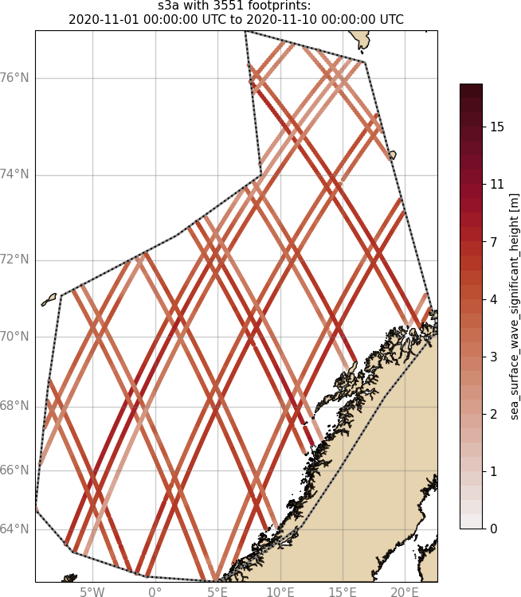
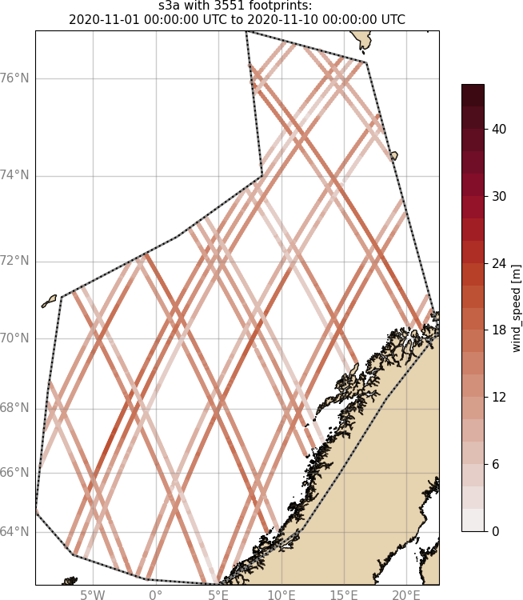
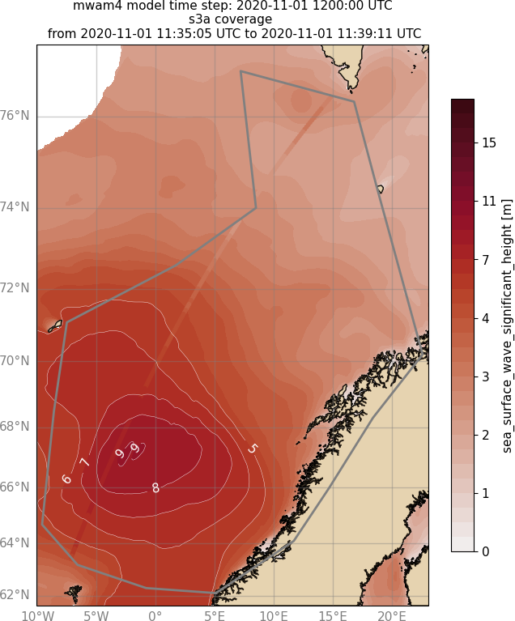
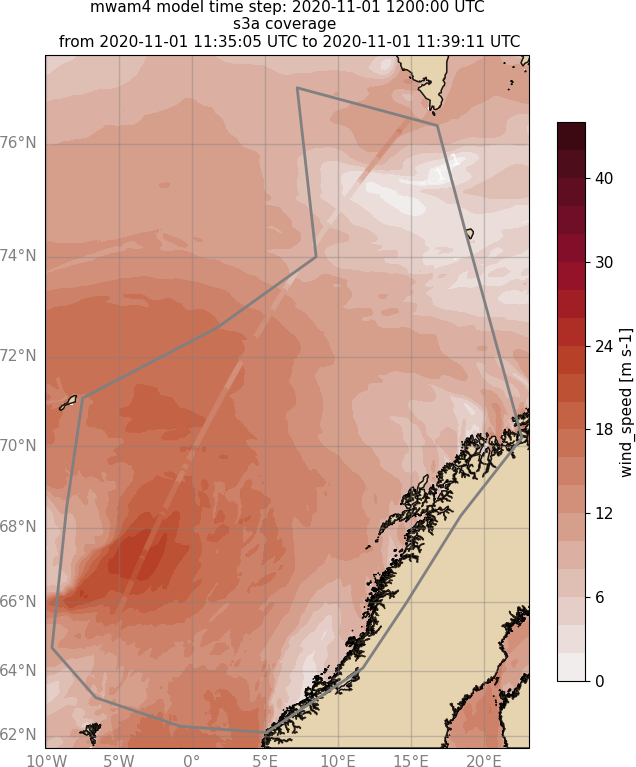

Wavy
====

Welcome to **wavy**!

Introduction
============
**wavy** is an open source package (under development) with the aim of easing the task of wave model validation. The user can either choose in-situ observation files or remote sensing files to extract time-series and/or collocate with wave model output.

+-------------------+------------------+
| |ex1|             | |ex2|            |
|                   |                  |
+-------------------+------------------+
| |ex3|             | |ex4|            |
|                   |                  |
+-------------------+------------------+

.. note::

   This project is under active development. I try to keep the documentation pristine. Please do not hesitate to contact me if you experience troubles, have questions, or would like to contribute.

Credits
=======
If you are using **wavy** please mention the repo under https://github.com/bohlinger/wavy and for info from the documentation refer to this page `https://wavyopen.readthedocs.io/ <https://wavyopen.readthedocs.io/en/latest/index.html>`_. Additionally, the collocation methodology should be referred to with the following article:

* Bohlinger, P., Breivik, Ø., Economou, T., Müller, M.: `A novel approach to computing super observations for probabilistic wave model validation <https://www.sciencedirect.com/science/article/pii/S1463500319300435>`_, Ocean Modelling, 139, `<https://doi.org/10.1016/j.ocemod.2019.101404>`_, 2019.

A selection of published studies and other work that use **wavy** can be found under :ref:`credits-label`.

Contents
========

.. toctree::
   :maxdepth: 4
   :glob:

   installation
   tutorials
   workshops
   oneocean
   credits
   gallery
   autoapi/index

Indices and tables
==================

* :ref:`genindex`
* :ref:`search`
* :doc:`autoapi/index`
