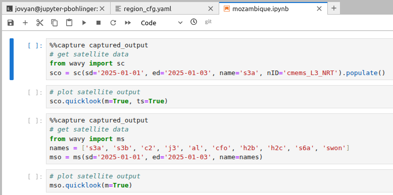
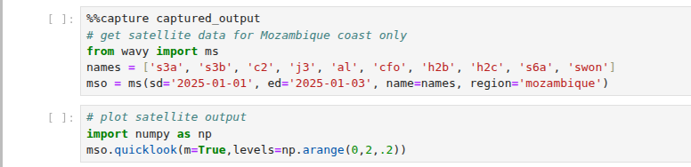
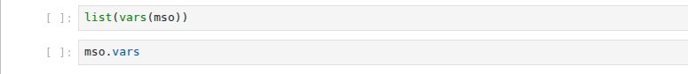
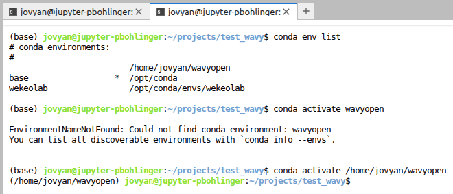

Mozambique WEkEO workshop 2025
==============================

**wavy** installation on WEkEO
#################################
WEkEO (wekeo.copernicus.eu) provides a workspace where you can run scripts and Jupyter notebooks on a cloud for free. As such WEkEO is a great platform to try out **wavy** in a lightweight context. Here are some quick instructions on how to install **wavy** on WEkEO:

Open a new command window on your WEkEO workspace and install python environment for wavyopen (with a python version >3.10 & <3.14):

.. code-block:: bash

   mamba create --name wavyopen python=3.12 --channel conda-forge
   conda activate wavyopen
   mamba install wavyopen

.. note::
   
   For some reason on WEkEO you need to use **conda activate wavyopen**
   instead of **mamba activate wavyopen**.

Install jupiter kernel:

.. code-block:: bash

    mamba install -n wavyopen ipykernel

Add it to jupyter:

.. code-block:: bash

   python -m ipykernel install --user --name wavyopen --display-name "Python (wavyopen)"

Restart JupyterLab Kernel List and refresh your JupyterLab tab in WEkEO.
Go to Kernel → Change Kernel, and you should see Python (wavyopen) in the list. Choose that one.

**wavy** config files and environment
########################################

Working with **wavy** can be done in many ways but since one often has multiple, independent projects, it may make sense to follow a general workflow of creating a project directory, specifying your environment variables, preparing config files, creating scripts/notebooks. Let's go through each of these steps together:

Create a project directory:

   .. code::

      mkdir ~/test_wavy
      mkdir -p ~/test_wavy/config
      mkdir -p ~/test_wavy/scripts
      mkdir -p ~/test_wavy/data

You can now almost proceed as usual but a minor hack needs to be made for setting your environmental variables in the invisible dot-file *.env* which is needed e.g. for the copernicus marine toolbox or to indicate the path to your config directory. To create an .env-file at the project root directory, first create a file called something visible like *envvis*.

.. code::

      cd ~/test_wavy
      touch envvis

Open the file and put in all information **wavy** needs like the path to your config directory:

.. code-block:: bash

    WAVY_CONFIG=

For the use of copernicusmarine for e.g. downloading satellite data use:

.. code-block:: bash

    COPERNICUSMARINE_SERVICE_USERNAME=
    COPERNICUSMARINE_SERVICE_PASSWORD=

Then cp your envvis to .env, i.e.

.. code-block:: bash

   cp envvis .env

to establish the invisible .env-file and voilà, everything should be in place.

Downloading data satellite data
##################################

You will need to ammend your config scripts to efficiently use **wavy**. First you need to retrieve them. To do so activate wavyopen to use the command line wavy scripts:

.. code-block:: bash

   conda activate wavyopen

For this tutorial we will need a config file for satellite retrieval and one for defining the regions. So go ahead and get them with:

.. code-block:: bash

      cd ~/test_wavy/config
      wavyCFG --help
      wavyCFG --path ./. --f satellite_cfg.yaml --t minimal
      wavyCFG --path ./. --f region_cfg.yaml --t default

Open satellite_cfg.yaml and ammend the paths for downloading (trgt_tmplt) and for wavy_input (src_tmplt). In my case the config file then looks like:

.. code-block:: yaml

    cmems_L3_NRT:
        name: {s3a: s3a, s3b: s3b, c2: c2, j3: j3, h2b: h2b, h2c: h2c, al: al, cfo: cfo, s6a: s6a, swon: swon}
        download:
            copernicus:
                dataset_id: cmems_obs-wave_glo_phy-swh_nrt_name-l3_PT1S
                trgt_tmplt: '/home/jovyan/projects/test_wavy/data/sat/L3/name'
                path_date_incr_unit: m
                path_date_incr: 1
                strsub: [name]
                server: nrt.cmems-du.eu
                time_incr: h
        wavy_input:
            src_tmplt: '/home/jovyan/projects/test_wavy/data/sat/L3/name'
            fl_tmplt: null
            strsub: [name]
            path_date_incr_unit: m
            path_date_incr: 1
        reader: read_local_ncfiles
        collector: get_remote_files_copernicusmarine
        vardef: {Hs: VAVH, U: WIND_SPEED}
        coords: null
        misc: {processing_level: null, provider: null, obs_type: null}
        tags: null

**wavy** can now download satellite data executing in your command line. For a specific satellite mission you can use e.g.:

.. code-block:: bash

    wavyDownload --sd 20250101 --ed 20250103 --nID cmems_L3_NRT --name s3a

or for all available missions:

.. code-block:: bash

    wavyDownload --sd 20250101 --ed 20250103 --nID cmems_L3_NRT --name all

Process satellite data
######################
Now, you can start preparing python scripts or notebooks reading, processing, and plotting your data. This may look like:

Since **wavy** is quite verbose I added the line *%%capture captured_output* on top of some cells. If you like you can remove it to see what is going on under the hood. You can also introduce your custom region in region_cfg.yaml, for Mozambique choose e.g.:

.. code-block:: yaml

   rect:
    mozambique: {llcrnrlon: 28.3, llcrnrlat: -27.8, urcrnrlon: 46, urcrnrlat: -10}

Applied to the notebook this looks like:

The data you retrieved is stored in the respective objects *sco* and *mso*. You can explore the content by e.g.:

.. note::
   
   For some reason on WEkEO you sometimes loose the name for your conda environment. In this case, type **conda env list** to find the environment you would like to use and activate it. An example is below:

