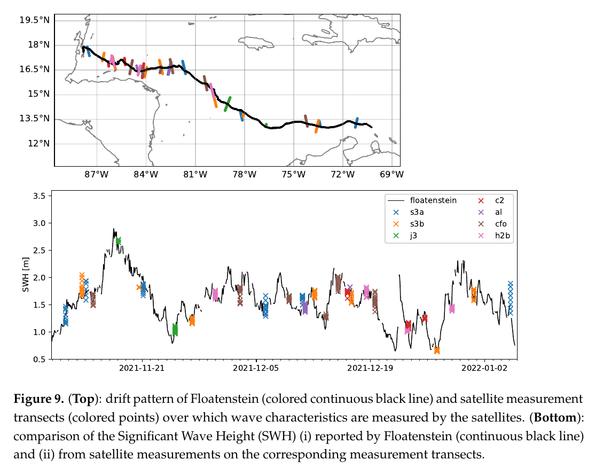

One Ocean Expedition
====================

.. note::

   The codes used for this section are from an older version of **wavy**. It can be adapted with the newest version of the package, however you can still find the version used for this workshop on `github <https://github.com/bohlinger/wavy/tree/595bd10afed4641f6add63e120052dfc98e8a26a>`_.
   
The following examples are drawn from work where **wavy** was used  related to the `One Ocean Expedition <https://oneoceanexpedition.com/>`_.

1. Collocating satellite tracks with drifter
############################################
In `Rabault et al. (2022) <https://www.mdpi.com/2076-3263/12/3/110>`_ we compared a drifter (floatenstein) that can measure waves to satellite altimetry. To do something similar you need to obtain the following drifter time series as lists:
- time as datetime objects
- longitudes
- latitudes

Those need to be formulated in a dictionary such that **wavy** can parse it.

.. code-block:: python3

   >>> poi_dict = {'datetime':dt,'longitude':lons,'latitude':lats}

Now load the satellite class from wavy and hit play:

.. code-block:: python3

   >>> from wavy.satmod import satellite_class as sc
   >>> sco = sc(twin=30,distlim=50,mission='j3',region='global',poi=poi_dict)

After you can save the results as pickle or netcdf and make a figure as in Rabault et al. (2022).

2. Collocating model output with drifter
########################################
In a different experiment we compare Hs from a wave sensor onboard Statsraad Lemkuhl with the ecmwf wave model ecwam. Again we need from the instrument:
- time as datetime objects
- longitudes
- latitudes
- observations
- and some name (nID)

Those need to be formulated in a dictionary such that **wavy** can parse it.

.. code-block:: python3

   >>> poi_dict = {'time':dt,'longitude':lons,'latitude':lats,'obs':obs,'nID':'OneOcean'}

Import **wavy**'s collocation class add some collocation specifications and hit play:

.. code-block:: python3

   >>> from wavy.collocmod import collocation_class as cc
   >>> cco = cc(poi=poi_dict,model='ecwam_Hs',twin=30,date_incr=1,varalias='Hs',distlim=30)

.. note::

   The observations may consist of missing values of the same length as the other parameters in case only a trajectory is of interest and not actual values from a drifter.
