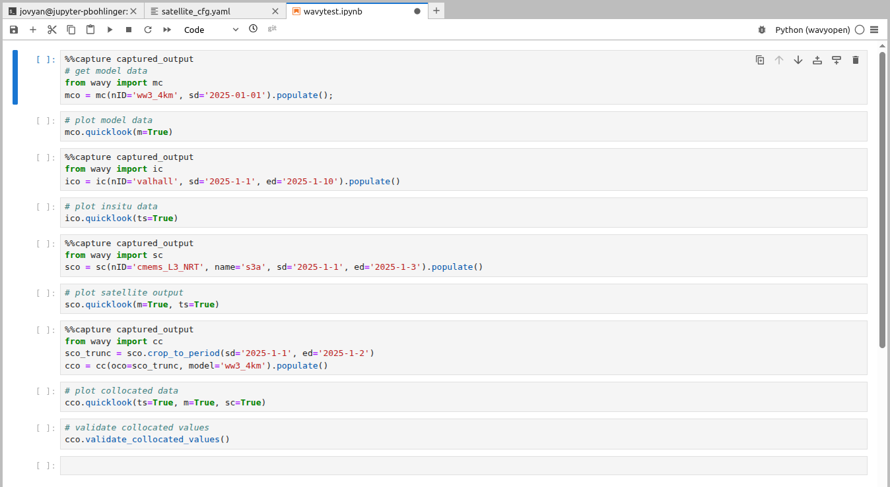

**wavy** on WEkEO
#################

WEkEO (wekeo.copernicus.eu) provides a workspace where you can run scripts and Jupyter notebooks on a cloud for free. As such WEkEO is a great platform to try out wavy in a lightweight context. Here are some quick instructions on how to install **wavy** on WEkEO:

Open a new command window on your WEkEO workspace and install python environment for wavyopen:

.. code-block:: bash

   mamba create --name wavyopen --channel=conda-forge
   conda activate wavyopen
   mamba install wavyopen

.. note::
   
   For some reason on WEkEO you need to use **conda activate wavyopen**
   instead of **mamba activate wavyopen**.

Install jupiter kernel:

.. code-block:: bash

    mamba install -n wavyopen ipykernel

Add it to jupyter:

.. code-block:: bash

   python -m ipykernel install --user --name wavyopen --display-name "Python (wavyopen)"

Restart JupyterLab Kernel List and refresh your JupyterLab tab in WEkEO.
Go to Kernel → Change Kernel, and you should see Python (wavyopen) in the list.

Create a project directory and the usual setup with config, data, and scrips. Now, you can almoist proceed as usual but a hack needs to be made for the invisible dot-files.

To create an .env file at the project root dir, first create a file called something visible like envtmp and put in all information **wavy** needs like:

.. code-block:: bash

    WAVY_CONFIG=

For the use of copernicusmarine use:

.. code-block:: bash

    COPERNICUSMARINE_SERVICE_USERNAME=
    COPERNICUSMARINE_SERVICE_PASSWORD=

for FROST add:

.. code-block:: bash

    CLIENT_ID=
    CLIENT_SECRET=

Then cp your envtmp to .env, i.e.

.. code-block:: bash

   cp envtmp .env
   
to establish the invisible .env-file and voilà everything should be in place.

As usual you have to ammend your config scripts to efficiently use **wavy**. This is done as usual but let's do one example with it. Go to your config directory and run:

.. code-block:: bash

   wavyCFG --f satellite_cfg.yaml --path ./. --t minimal

Then ammend the paths for downloading (trgt_tmplt) and for wavy_input (src_tmplt). In my case the config file then looks like:

.. code-block:: yaml

    cmems_L3_NRT:
        name: {s3a: s3a, s3b: s3b, c2: c2, j3: j3, h2b: h2b, h2c: h2c, al: al, cfo: cfo, s6a: s6a, swon: swon}
        download:
            copernicus:
                dataset_id: cmems_obs-wave_glo_phy-swh_nrt_name-l3_PT1S
                trgt_tmplt: '/home/jovyan/projects/test_wavy/sat/L3/name'
                path_date_incr_unit: m
                path_date_incr: 1
                strsub: [name]
                server: nrt.cmems-du.eu
                time_incr: h
        wavy_input:
            src_tmplt: '/home/jovyan/projects/test_wavy/sat/L3/name'
            fl_tmplt: null
            strsub: [name]
            path_date_incr_unit: m
            path_date_incr: 1
        reader: read_local_ncfiles
        collector: get_remote_files_copernicusmarine
        vardef: {Hs: VAVH, U: WIND_SPEED}
        coords: null
        misc: {processing_level: null, provider: null, obs_type: null}
        tags: null

Then wavy can download satellite data and retrieve FROST data. For satellite do e.g.:

.. code-block:: bash

    wavyDownload --sd 20250101 --ed 20250102 --nID cmems_L3_NRT --name s3a

Now you can try out lines like in the other tutorials, e.g.:

In the Jupyter notebook on WEkEO it may be beneficial to damped the quite verbose output from wavy starting the processing cells with:

.. code-block:: bash

   %%capture captured_output
