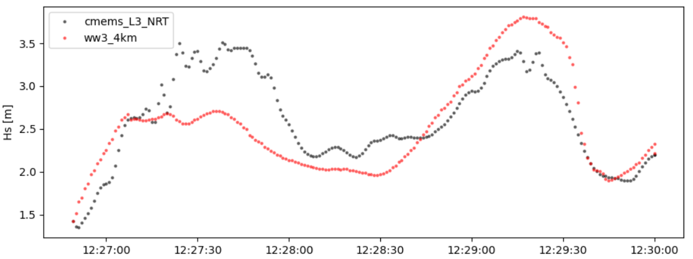
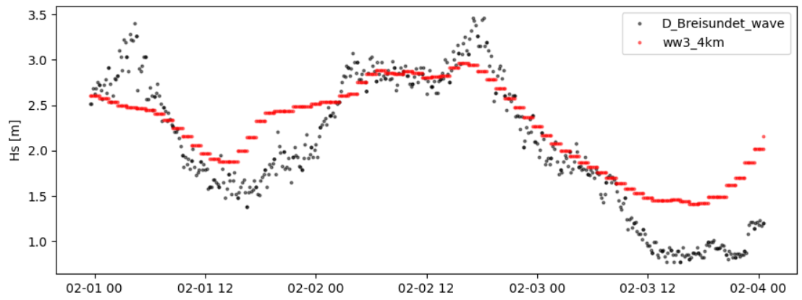

Collocating model output and observations
#########################################

One of the main focus of **wavy** is to ease the collocation of observations and numerical wave models for model validation. For this purpose there is a collocation module and a config-file called collocation_specs.yaml where you can specify the name and path for the collocation file to be dumped if you wish to save them.

Collocation of satellite and wave model
****************************************

.. code-block:: python3

   >>> from wavy.satellite_module import satellite_class as sc
   >>> from wavy.collocation_module import collocation_class as cc

   >>> path = '/path/to/your/wavy/tests/data/L3/s3a/'
   >>> sd = "2022-2-1 12"
   >>> ed = "2022-2-1 12"
   >>> name = 's3a'
   >>> varalias = 'Hs'
   >>> twin = 30
   >>> nID = 'cmems_L3_NRT'
   >>> model = 'ww3_4km'
   >>> sco = sc(sd=sd, ed=ed, nID=nID, name=name,
   ...         varalias=varalias, twin=twin)
   >>> sco = sco.populate(reader='read_local_ncfiles',
   ...                    path=path)
   >>> sco = sco.crop_to_region(model)
   >>> cco = cc(oco=sco, model=model, leadtime='best', distlim=6).populate()

This can also be done for a time period:

.. code-block:: python3

   >>> sd = "2020-11-1"
   >>> ed = "2020-11-5"
   >>> sco = sc(sdate=sd,edate=ed,region=model,mission=mission,varalias=varalias)
   >>> cco = cc(model=model,obs_obj_in=sco,distlim=6).populate()

For the collocation class object there is also a quicklook fct implemented which allows to view time series, a scatterplot, and a map as for the satellite class object::

   >>> cco.quicklook(ts=True)
   >>> cco.quicklook(sc=True)
   >>> cco.quicklook(m=True)
   >>> cco.quicklook(a=True) # for all plots to be displayed

Collocation of in-situ data and wave model
******************************************

The following example demonstrates the comparison of collocating a raw in-situ time series against a filtered one and may take a few minutes.

.. code-block:: python3

   >>> from wavy.collocation_module import collocation_class as cc
   >>> from wavy.insitu_module import insitu_class as ic

   >>> sd = "2022-2-1"
   >>> ed = "2022-2-4"
   >>> varalias = 'Hs'
   >>> twin = 30
   >>> model = 'ww3_4km'
   >>> nID = 'D_Breisundet_wave'
   >>> name = 'wavescan'
   >>> ico = ic(nID=nID, sd=sd, ed=ed, varalias=varalias,
   ...         name=name, twin=twin)
   >>> ico = ico.populate()
   >>> cco = cc(oco=ico, model=model, leadtime='best', distlim=6).populate()

Let's plot the results:

.. code-block:: python3

   >>> cco.quicklook(ts=True)

