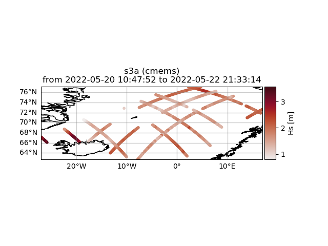

Apply filters
#############

Basic, but very useful, filters can be applied to the altimtery time series by activating the "filterData" key word and some filter specific key words regarding the desired filter. An example of filtering the CMEMS L3 time series is given below:

.. code-block:: python3

    >>> from wavy.satmod import satellite_class as sc
    >>> sco_lm = sc(sdate="2022-5-20",edate="2022-5-23",region="NordicSeas", filterData=True, land_mask = True)
    >>> sco_lm.quicklook()

.. image:: ./lm_example.png
   :scale: 100

In the above example we filter the retrieved Sentinel-3A L3 time series of seignificant wave height by an highly accurate land/sea mask filter for the region "NordicSeas". In this case there was no misplaced footprint and all values are used.

Another function is to specify distance to shore in order to exclude satellite footprints where the wave form was possibly corrupted by land in its vicinity. A lower and uper bound can be introduced. For this task we first have to activate the "distance-to-coast mask" dtc_mask and then the upper and lower limits by setting "dtc_llim" and "dtc_ulim", respectively.

.. code-block:: python3

    >>> from wavy.satmod import satellite_class as sc
    >>> sco_lm_dc = sc(sdate="2022-5-20",edate="2022-5-23",region="NordicSeas", filterData=True, land_mask = True, dtc_mask= True,dtc_llim = 200, dtc_ulim= 300)
    >>> sco_lm_dc.quicklook()

.. image:: ./lm_example_coast.png
   :scale: 100

It is clearly visible that there is a minimum distance now to the shoreline as well as a maximum distance. So only footprints within a distance of between 200-300 km from the coast are included.

This request can be refined even further by specifying a list of countries for which one wants these conditions to be true. In the following example we want the distance to shore only to be valid for the coast of Norway.

.. code-block:: python3

    >>> from wavy.satmod import satellite_class as sc
    >>> sco_lm_dcl = sc(sdate="2022-5-20",edate="2022-5-23",region="NordicSeas", filterData=True, land_mask = True, dtc_mask= True,dtc_llim = 200, dtc_ulim= 1000, dtc_lst_of_countries=['Norway'])
    >>> sco_lm_dcl.quicklook()

Now, we can see that the footprints are closer again to Iceland but still distant to Norway which we explicitly requested.
