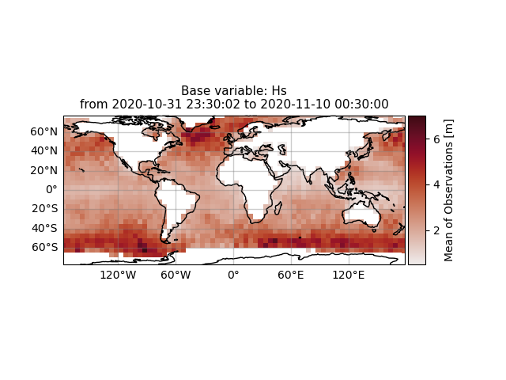
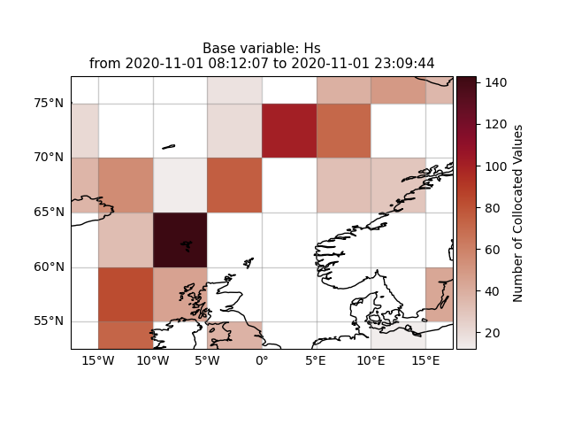
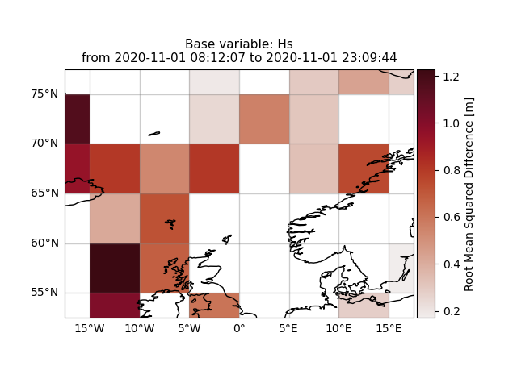

Gridded satellite observations and statistics
#############################################

Once satellite observations are retrieved or even collocated model data are available **wavy** can display this data in custom grids for your region of interest.

Gridding of satellite observations
**********************************

Retrieve satellite observations from multiple satellites:

.. code-block:: python3

   >>> from wavy.satellite_module import satellite_class as sc
   >>> path = '/home/patrikb/wavy/tests/data/L3/s3a/'
   >>> sd = '2022-2-1'
   >>> ed = '2022-2-2'
   >>> region = 'global'
   >>> name = 's3a'
   >>> nID = 'cmems_L3_NRT'
   >>> sco = sc(sd=sd,ed=ed,region=region,nID=nID,name=name).populate(path=path)

Apply the gridder:

.. code-block:: python3

   >>> from wavy.gridder_module import gridder_class as gc
   >>> from wavy.grid_stats import apply_metric
   >>> bb = (-179, 178, -80, 80)  # lonmin,lonmax,latmin,latmax
   >>> res = (5, 5) # lon/lat
   >>> gco = gc(oco=sco,bb=bb,res=res)
   >>> gridvar, lon_grid, lat_grid = apply_metric(gco=gco)
   >>> gco.quicklook(val_grid=gridvar,
   ...               lon_grid=lon_grid,
   ...               lat_grid=lat_grid,
   ...               metric='mor', land_mask_resolution='i',
   ...               mask_metric_llim=1,
   ...               title='')
   

Information of the grid and the values from observations and model can also be obtained directly from the gridder_class object:

.. code-block:: python3

   >>> ovals,mvals,Midx = gco.get_obs_grid_idx()

ovals represent observation values, mvals are model values, and Midx is the matrix of indices. *mvals* is empty since no model values have been retrieved yet.

Gridding of collocated data
***************************
We first need to collocate the data with the collocation_class

.. code-block:: python3

   >>> from wavy.collocation_module import collocation_class as cc 
   >>> # collocate
   >>> cco = cc(model='ww3_4km',oco=sco,distlim=6,leadtime='best').populate()
   >>> # reduce region to part of model domain for better visual
   >>> bb = (-20,20,50,80) # lonmin,lonmax,latmin,latmax
   >>> res = (5,5) # lon/lat
   >>> gco = gc(cco=cco,bb=bb,res=res)
   >>> var_gridded_dict,lon_grid,lat_grid = apply_metric(gco=gco)
   >>> # plot all validation metrics on grid
   >>> gco.quicklook(val_grid=var_gridded_dict,lon_grid=lon_grid,lat_grid=lat_grid,metric='all')

+-------------------+------------------+
| |ex1|             | |ex2|            |
|                   |                  |
+-------------------+------------------+
