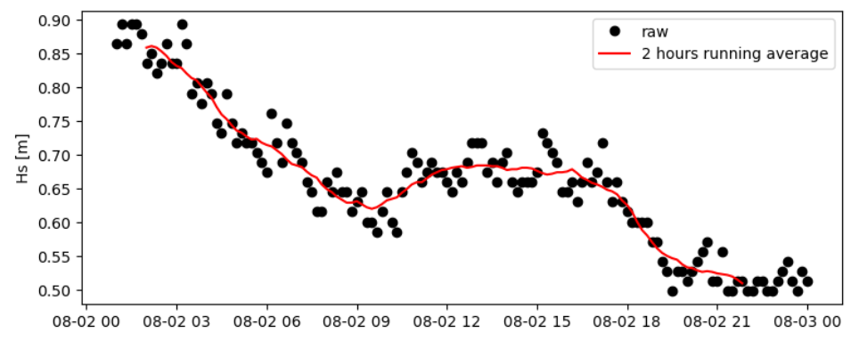
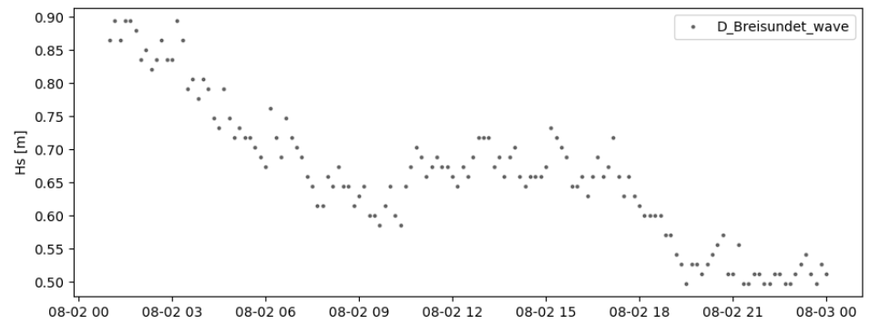

Read in-situ observations (netcdf/thredds, FROST API)
###########################################################

Currently two data types can be read .d22-files and netcdf-files. Together 4 datasources can be accessed: d22-files, nc-files, thredds-server, FROST API. Edit the insity_specs.yaml file in your config folder and adjust the directories.

make a FROST call
*****************

For a FROST call **wavy** uses MET Norways FROST API v1. A FROST call would be similar compared to the previous example, only the file format needs to be adjusted, here illustrated for the Draugen platform:

.. code-block:: python3

   >>> from wavy.insitu_module import insitu_class as ic

   >>> varalias = 'Hs' # default
   >>> sd = "2021-8-2 01"
   >>> ed = "2021-8-3 00"
   >>> nID = 'draugen'
   >>> sensor = 'MKIIIradar_1'
   >>> ico = ic(nID=nID, sd=sd, ed=ed, varalias=varalias, name=sensor)
   >>> ico = ico.populate()

read .nc-files
**************

.. code-block:: python3

   >>> from wavy.insitu_module import insitu_class as ic

   >>> varalias = 'Hs'
   >>> sd = "2021-8-2 01"
   >>> ed = "2021-8-3 00"
   >>> nID = 'D_Breisundet_wave'
   >>> sensor = 'wavescan'
   >>> ico = ic(nID=nID, sd=sd, ed=ed, varalias=varalias, name=sensor)
   >>> ico = ico.populate()

Then you can smooth the obtained time series with a running mean, specifying the number of observations used and the sampling rate of the measurements: 

.. code-block:: python3

   >>> # running mean filter
   >>> ico_bm = ico.filter_runmean(window=13, sampling_rate_Hz=1/600)

Now, let's check how this could look like:

.. code-block:: python3

   >>> import matplotlib.pyplot as plt
   >>> fig = plt.figure(figsize=(9,3.5))
   >>> ax = fig.add_subplot(111)
   >>> ax.plot(ico.vars['time'],ico.vars[varalias],'ko',label='raw')
   >>> ax.plot(ico_bm.vars['time'],ico_bm.vars[varalias],'r-',label='2 hours running average')
   >>> plt.legend(loc='upper right')
   >>> plt.ylabel('Hs [m]')
   >>> plt.show()

Again, for the insitu class there is also a quicklook function available::

   >>> ico.quicklook(ts=True)
   

