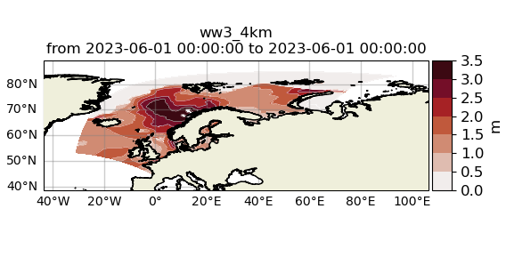

Read model data
###############

Model output can be accessed and read using the model_module. The model_module config file model_cfg.yaml needs adjustments if you want to include a model that is not present as default. Given that the model output file you would like to read follows the cf-conventions and standard_names are unique, the minimum information you have to provide are usually the following as illustrated with the WAVEWATCH III example:

.. code-block:: yaml

    ww3_4km:
        name: ww3_4km
        download:
        wavy_input:
            src_tmplt: /Path/To/
            fl_tmplt: myfile
        reader: read_ww3_4km
        collector:
        vardef:
            Hs: hs
            time: time
            lons: longitude
            lats: latitude
        coords:
        misc:
            init_times: [0,6,12,18]
            init_step: 6
            grid_date: 2021-11-16 00:00:00
            date_incr_unit: h
            date_incr: 1
        tags:

Often there are ambiguities due to the multiple usage of standard_names. Any such problem can be solved here in the config-file by adding the specified variable names under *vardef*. Examples are given in the default model_cfg.yaml file.

The variable aliases (left hand side) need to be specified in the variable_def.yaml. Basic variables are already defined. All specs listed here are also used when **wavy** writes the retrieved values to netcdf.

.. code-block:: python3

   >>> from wavy.model_module import model_class as mc
   >>> nID = 'ww3_4km' # default
   >>> varalias = 'Hs' # default
   >>> sd = "2023-6-1"
   >>> ed = "2023-6-1 01"
   >>> mco = mc(nID=nID, sd=sd).populate() # one time slice
   >>> mco_p = mc(nID=nID, sd=sd, ed=ed).populate() # time period

Whenever the keyword "leadtime" is None, a best estimate is assumed and retrieved. The output will be something like::

   >>> mco = mc(nID=nID, sd=sd)

   >>> mco.
   mco.cfg                mco.filter             mco.meta               mco.quick_anim(        mco.stdvarname         
   mco.coords             mco.get_item_child(    mco.model              mco.quicklook(         mco.units              
   mco.crop_to_period(    mco.get_item_parent(   mco.nID                mco.reader(            mco.varalias           
   mco.distlim            mco.leadtime           mco.pathlst            mco.region             mco.varname            
   mco.ed                 mco.list_input_files(  mco.populate(          mco.sd                 mco.vars     

   >>> mco.vars.keys()
   KeysView(<xarray.Dataset>
   Dimensions:  (time: 1, rlat: 1026, rlon: 624)
   Coordinates:
     * rlat     (rlat) float64 -14.35 -14.31 -14.27 -14.23 ... 26.57 26.61 26.65
     * rlon     (rlon) float64 5.53 5.57 5.61 5.65 5.69 ... 30.33 30.37 30.41 30.45
     * time     (time) datetime64[ns] 2023-06-01
   Data variables:
       Hs       (time, rlat, rlon) float32 1.183 1.183 1.183 1.182 ... nan nan nan
       lons     (time, rlat, rlon) float32 -31.02 -30.96 -30.9 ... 65.7 65.7 65.69
       lats     (time, rlat, rlon) float32 53.25 53.24 53.24 ... 62.01 61.97 61.94
   Attributes: (12/38)
       WAVEWATCH_III_version_number:    6.07
       WAVEWATCH_III_switches:          F90 NOGRB NOPA LRB4 NC4 TRKNC DIST MPI P...
       product_name:                    4km operational wave model forecast product
       area:                            4km operational domain covering: Nordic ...
       date_created:                    2023-06-01T03:19:09Z
       title:                           ww3_4km / operational wave forecast MET ...
       ...                              ...
       time_coverage_end:               2023-06-03T18:00:00Z
       Conventions:                     CF-1.6, ACDD-1.3
       NCO:                             netCDF Operators version 5.0.6 (Homepage...
       history:                         Thu Jun  1 03:19:27 2023: ncatted -O -a ...
       Forcing:                         cat: tmp.txt: No such file or directory\n
       DODS_EXTRA.Unlimited_Dimension:  time)

For the modelclass objects a quicklook fct exists to depict a certain time step of what you loaded::

   >>> mco.quicklook(m=True) # for a map

.. note::

   Even though it is possible to access a time period, **wavy** is not yet optimized to do so and the process will be slow. The reason, being the ambiguous use of lead times, will be improved in future versions.

