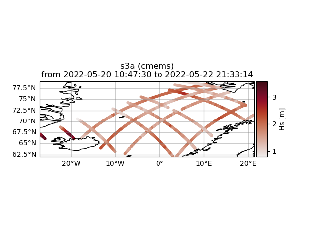
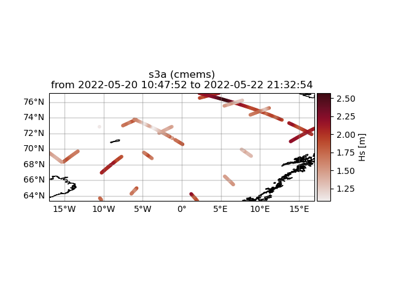

Apply filters
#############

Basic, but very useful, filters can be applied to the altimtery time series using filter methods. An example of filtering the CMEMS L3 time series is given below:

.. code-block:: python3

    >>> from wavy.satellite_module import satellite_class as sc
    >>> path = '/path/to/your/wavy/tests/data/L3/s3a'
    >>> nID = 'cmems_L3_NRT'
    >>> name = 's3a'
    >>> region = 'NordicSeas'
    >>> sd = '2022-2-1'
    >>> ed = '2022-2-3'

    >>> sco_lm = sc(nID=nID, name=name, sd=sd, ed=ed, region=region)\
    ...        .populate(path=path)\
    ...        .filter_landMask()
    >>> sco_lm.quicklook(m=True)

In the above example we filter the retrieved Sentinel-3A L3 time series of seignificant wave height by an highly accurate land/sea mask filter for the region "NordicSeas". In this case there was no misplaced footprint and all values are used.

Another function is to specify distance to shore in order to exclude satellite footprints where the wave form was possibly corrupted by land in its vicinity. A lower and uper bound can be introduced. For this task we can apply an additional method to the already filtered data obtained above. The method is filter_distance_to_coast, and must be given the upper and lower limits by setting "llim" and "ulim" in meters, respectively.

.. code-block:: python3

    >>> sco_lm = sco_lm.filter_distance_to_coast(llim=200000, ulim=300000)
    >>> sco_lm.quicklook(m=True)

It is clearly visible that there is a minimum distance now to the shoreline as well as a maximum distance. So only footprints within a distance of between 200-300 km from the coast are included.
