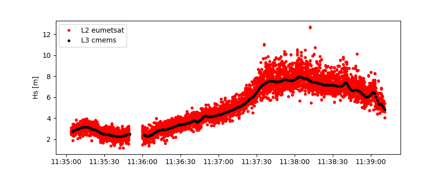

Use satellite data
##################

One strength of **wavy** is to ease obtaining and using satellite altimetry data. To get an overview over the supported missions or data sources go to wavy/apps/standalone and execute:

.. code-block:: bash
   $ ./wavyDownload.py -h

or:
.. code-block:: bash
   $ ./wavyQuick.py -h

The help-message displayed would give you, among other information, the following options:

.. code-block:: bash

    cmems_L3_NRT:            
     s3a - Sentinel-3A            
     s3b - Sentinel-3B            
     j3 - Jason-3 (reference mission)            
     c2 - Cryosat-2            
     al - SARAL/AltiKa            
     cfo - CFOSAT            
     h2b - HaiYang-2B            
                
    cmems_L3_s6a:            
     s6a - Sentinel-6A Michael Freilich            
                
    eumetsat_L2:            
     s3a - Sentinel-3A            
     s3b - Sentinel-3B            
                
    cci_L2P:            
     j1 - Jason-1            
     j2 - Jason-2            
     j3 - Jason-3            
     c2 - Cryosat-2            
     envisat - Envisat            
     ers1 - European Remote-Sensing Satellite-1            
     ers2 - European Remote-Sensing Satellite-2            
     topex - TOPEX/Poseidon            
     al - SARAL/AltiKa            
     gfo - GEOSAT Follow-On            
        
    cci_L3:            
     multi - multimission product 1991-2018 

    cfo_swim_L2P:
     cfo - CFOSAT

This means that for product cmems_L3_NRT you can choose among 7 satellite missions. Unfortunatley, most of the satellite data is not accessible via thredds or similar options but needs to be downloaded from e.g. a VPN server. To do that you would need the credentials for Copernicus CMEMS, CEDA, or for the AVISO cataloque as these are the main sources that **wavy** currently exploits.

**wavy** relies on you to store the respective usernames and passwords in your local .netrc file. This could look like:

.. code::

   machine nrt.cmems-du.eu    login {USER}  password {PASSWORD}
   machine my.cmems-du.eu     login {USER}  password {PASSWORD}
   machine ftp.ceda.ac.uk    login {USER}  password {PASSWORD}
   machine ftp-access.aviso.altimetry.fr    login {USER}  password {PASSWORD}

Now, prepare your **wavy** environment with providing the directories for satellite data and model data. Add your path for satellite data here demonstrated for CMEMS with my user:

.. code-block:: yaml

   cmems_L3_NRT:
      dst:
         path_template: /home/patrikb/tmp_altimeter/L3/mission

There exists also something called strsub which defines strings that are o substituted. In this case some are predefined as:

.. code-block:: yaml

   strsub: ['varalias','mission','region']

The str "mission" in your path_template will be replaced by the satellite mission that you download. So for Sentinel-3a the final path for your downloaded files will be automatically /home/patrikb/tmp_altimeter/L3/s3a with subfolders on year and month.

You can proceed now and download CMEMS NRT L3 data using the wavyDownload.py script:

.. code-block:: bash

   $ cd ~/wavy/apps/standalone

To get help check ...

.. code-block:: bash

   $ ./wavyDownload.py -h

... or download some satellite altimeter data:

.. code-block:: bash

   $ ./wavyDownload.py -sat s3a -sd 2020110100 -ed 2020111000 -product cmems_L3_NRT

You can find the downloaded files in your chosen download directory.

Similarily one can download L2P and L3 multi-mission altimetry data from the CEDA Climate Change Initiative. This spans a long time period from 1991 to 2018 and enables climate related research and wave model hindcast validation.

.. code-block:: bash

   $ ./wavyDownload.py -sat multi -sd 2017112000 -ed 2017112100 -product cci_L3

As a next step, you can access these data everywhere with wavy when having set your .env file and the WAVY_CONFIG path therein. For illustration purposes, let's create a directory called ~/project_tmp. This is now your project directory. Let's assume your ammended satellite_specs.yaml file is in this directory. In this directory create an .env file with the content e.g.:

.. code-block:: bash
   WAVY_CONFIG=/home/patrikb/project_tmp/

The content of your directory looks then like:

.. code-block:: bash
   (base) patrikb@pc5591:~/project_tmp$ ls -la
   total 20
   drwxrwxr-x  2 patrikb patrikb 4096 Aug  3 12:31 .
   drwx------ 52 patrikb patrikb 4096 Aug  3 13:51 ..
   -rw-rw-r--  1 patrikb patrikb   31 Aug  3 12:31 .env
   -rwxr-xr-x  1 patrikb patrikb 6257 Aug  3 12:31 satellite_specs.yaml

Now, open python in the wavy conda environment:

.. code-block:: bash
   
   $ conda activate wavy
   $ python

.. code-block:: python3

   >>> # imports
   >>> from wavy.satmod import satellite_class as sc

   >>> # settings
   >>> region = 'global'
   >>> varalias = 'Hs' # default
   >>> mission = 's3a' # default
   >>> product = 'cmems_L3_NRT' # default
   >>> twin = 30 # default
   >>> sd = "2020-11-1" # can also be datetime object
   >>> ed = "2020-11-2" # not necessary if twin is specified

   >>> # retrieval
   >>> sco = sc(sdate=sd,edate=ed,region=region)

Or in one line:

.. code-block:: python3

   >>> sco = sc(sdate="2020-11-1",edate="2020-11-2",region="global")

You have now read in 24 hours of significant wave height from the satellite mission s3a. The stdout message looks like::

   >>> sco = sc(sdate="2020-11-1",edate="2020-11-2",region="global")
   # ----- 
    ### Initializing satellite_class object ###
         
   Requested time frame: 2020-11-01 00:00:00 - 2020-11-02 00:00:00
   Chosen time window is: 30 min
   No download initialized, checking local files
         
    ## Find files ...
   path_local is None -> checking config file
   /home/patrikb/tmp_altimeter/L3/s3a/2020/10
   /home/patrikb/tmp_altimeter/L3/s3a/2020/11
   16 valid files found
         
    ## Read files ...
   Get filevarname for 
   stdvarname: sea_surface_wave_significant_height 
   varalias: Hs
   !!! standard_name:  sea_surface_wave_significant_height  is not unique !!! 
   The following variables have the same standard_name:
    ['VAVH', 'VAVH_UNFILTERED']
   Searching *_specs.yaml config file for definition
   Variable defined in *_specs.yaml is:
   Hs = VAVH
   100%|██████████████████████████████████████████| 16/16 [00:00<00:00, 215.52it/s]
   Concatenate ...
   ... done concatenating
   Total:  45677  footprints found
   Apply region mask
   Specified region: global
    --> Bounds: {'llcrnrlon': -180.0, 'llcrnrlat': -90.0, 'urcrnrlon': 180.0, 'urcrnrlat': 90.0}
   45677  values found for chosen region and time frame.
   Region mask applied
   For chosen region and time:  45677 footprints found
         
    ## Summary:
   45677 footprints retrieved.
   Time used for retrieving satellite data: 0.29 seconds
         
    ### Satellite object initialized ###
   # ----- 

The satellite_class object has multiple class methods and class variables:

.. code-block:: python3

  >>> sco.
  sco.edate             sco.product           sco.units
  sco.get_item_child(   sco.provider          sco.varalias
  sco.get_item_parent(  sco.quicklook(        sco.varname
  sco.mission           sco.region            sco.vars
  sco.obstype           sco.sdate             sco.write_to_nc(
  sco.path_local        sco.stdvarname        sco.write_to_pickle(
  sco.processing_level  sco.twin

With the retrieved variables in sa_obj.vars::

   >>> sco.vars.keys()
   dict_keys(['sea_surface_wave_significant_height', 'time', 'time_unit', 'latitude', 'longitude', 'datetime', 'meta'])

You can readily explore what you obtained utilizing the quicklook function.

.. code-block:: python3

   >>> sco.quicklook(ts=True) # for time series
   >>> sco.quicklook(m=True) # for a map
   >>> sco.quicklook(full=True) # for both

Sentinel-3 A/B L2 altimetry data are of much higher frequency (20Hz) compared to L3 data (1Hz). L2 data can be obtained from eumetsat and colhub using the SentinelAPI. This requires user credentials for eumetsat and colhub, which are free of costs as well. Enter your account credentials into the .netrc-file as you did for the L3 data. Your .netrc should have included the following:

.. code::

   machine https://colhub.met.no/ login {USER} password {PASSWORD}
   machine https://coda.eumetsat.int/search login {USER} password {PASSWORD}

Ammend the satellite config file for L2 data and add the download directory of your choice like:

.. code-block:: yaml

   eumetsat_L2:
      L2:
         dst:
             path_template: /home/patrikb/tmp_altimeter/L2/mission

As you can see, this is customized to my username patrikb. Adjust this and continue with downloading some satellite altimeter data:

.. code-block:: bash

   $ ./wavyDownload.py -sat s3a -sd 2020110100 -ed 2020111000 -product eumetsat_L2

**wavy** will now invoke the SentinelAPI and download the correct data. The data can be read just as with the L3 data as e.g.:

.. note::

   There are currently problems with L2 from eumetsat/colhub which
   will hopefully be fixed again.

.. code-block:: python3

   >>> from wavy.satmod import satellite_class as sc
   >>> sd = "2020-11-1 12"
   >>> ed = "2020-11-1 12"
   >>> region = 'mwam4' # default
   >>> mission = 's3a' # default
   >>> twin = 30 # default
   >>> varalias = 'Hs' # default

   >>> sco = sc(sd,edate=ed,product="eumetsat_L2")

You could also compare L2 to L3:

.. code-block:: python3

   >>> # imports
   >>> from wavy.satmod import satellite_class as sc

   >>> # settings
   >>> sd = "2020-11-1 12"
   >>> ed = "2020-11-1 12"
   >>> region = 'NorwegianSea'
   >>> mission = 's3a' # default
   >>> varalias = 'Hs' # default
   >>> twin = 30 # default

   >>> # retrievals
   >>> sco_e = sc(sd,edate=ed,region=region,product='eumetsat_L2')
   >>> sco_c = sc(sd,edate=ed,region=region,product='cmems_L3_NRT')

   >>> # plotting
   >>> import matplotlib.pyplot as plt
   >>> stdname = sco_e.stdvarname
   >>> fig = plt.figure(figsize=(9,3.5))
   >>> ax = fig.add_subplot(111)
   >>> ax.plot(sco_e.vars['datetime'],sco_e.vars[stdname],'r.',label='L2 eumetsat')
   >>> ax.plot(sco_c.vars['datetime'],sco_c.vars[stdname],'k.',label='L3 cmems')
   >>> plt.legend(loc='upper left')
   >>> plt.ylabel('Hs [m]')
   >>> plt.show()

This yields the following figure:

