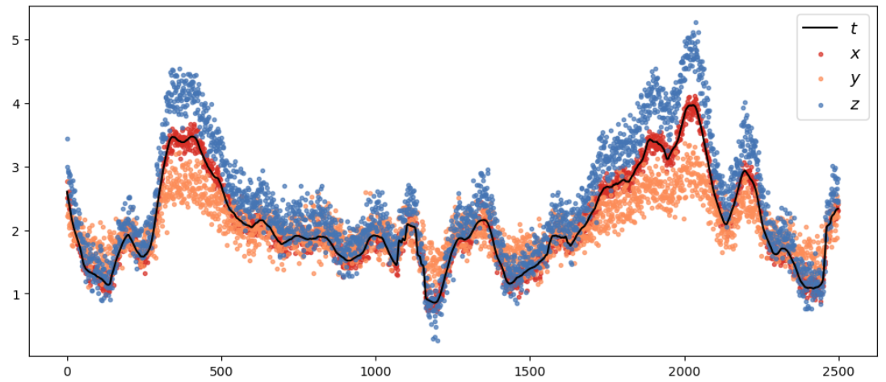
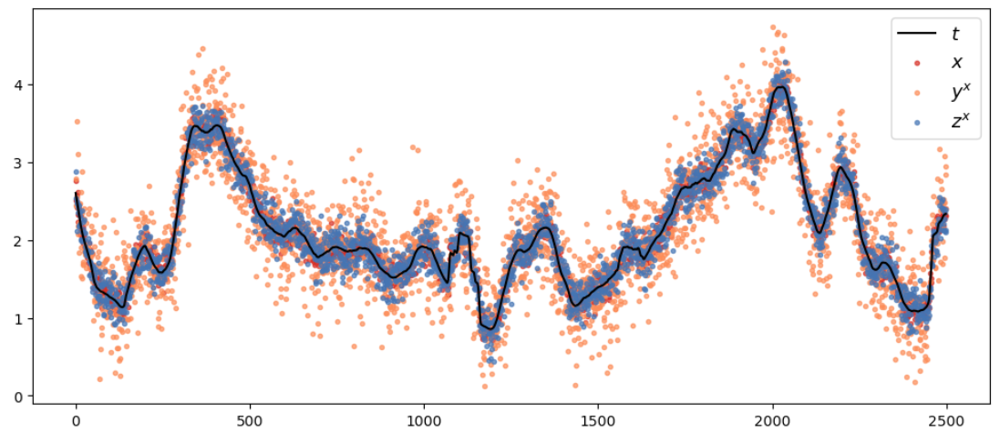

Triple Collocation
##################

Method
******

When you have the possibility to have three sources of data, you can use Triple Collocation analysis (Stoffelen, 1998) in order to estimate the variance of random error of different measurements directly with reference to the true common signal. 

Indeed, assuming you try to measure a common signal t, that could be significant wave height for example. Say you have three independent collocated measurements of :math:`t`, :math:`(x,y,z)` such that: 

:math:`x = t + \epsilon_x`

:math:`y = a_y t + b_y + \epsilon_y`

:math:`z = a_z t + b_z + \epsilon_z`

Where :math:`x` is a source considered bias free and calibrated relatively to the common signal, :math:`b_y, b_z, a_y, b_y` are dneoted as calibration constants. And :math:`\epsilon_x, \epsilon_y, \epsilon_z` are random error of measurements :math:`x, y, z` respectively. 

Assuming in addition that :math:`\forall i \in \{x,y,z\}`: 

- Errors are unbiased:

:math:`<\epsilon_i> = 0`

- Errors are independant from the common signal: 

:math:`<\epsilon_i t> = <\epsilon_i><t>=0`

- There is no cross-correlation between errors: 

:math:`<\epsilon_x\epsilon_y>=<\epsilon_x\epsilon_z>=<\epsilon_y\epsilon_z>=0`

- Error variances are constant over the range of values under consideration

Then the variances of error of the three measurements can be estimated as follows: 

:math:`<\epsilon_{x}^{2}> = C_{xx} - \frac{C_{xy}C_{xz}}{C_{yz}}`

:math:`<\epsilon_{y}^{2}> = C_{yy} - \frac{C_{yx}C_{yz}}{C_{xz}}`

:math:`<\epsilon_{z}^{2}> = C_{zz}- \frac{C_{zx}C_{zy}}{C_{xy}}`

where the covariance between measurements :math:`i,j \in \{x,y,z\}` is denoted as:

:math:`C_{ij} = <ij> - <i><j>`

Additionally, it is possible to calibrate measurements :math:`y` and :math:`z` relatively to :math:`x` as in Gruber et al., 2016. Calibrated measurements :math:`y^x` and :math:`z^x` are obtained as follows: 

:math:`y^x=\frac{y-<y>}{a_y} + <x>= t + \frac{\epsilon_y}{a_y}` 

:math:`z^x=\frac{z-<z>}{a_z} + <x>= t + \frac{\epsilon_z}{a_z}` 

Where :math:`a_y = \frac{C_{yz}}{C_{xz}}` and :math:`a_z = \frac{C_{yz}}{C_{xy}}`.

Now applying Triple Collocation analysis to these calibrated data allows to obtain estimates of the variance of error of the measurements directly relatively to the true common signal since: 

:math:`<(x - t)^2>=<\epsilon_x^2> = C_{xx} -\frac{C_{xy^x}C_{xz^x}}{C_{y^xz^x}}` 

:math:`<(y^x - t)^2>=\frac{<\epsilon_y^2>}{a_y^2}= C_{y^x y^x} - \frac{C_{y^xx}C_{y^xz^x}}{C_{xz^x}}` 

:math:`<(z^x - t)^2>=\frac{<\epsilon_z^2>}{a_z^2}= C_{z^x z^x}- \frac{C_{z^xx}C_{z^x y^x}}{C_{xy^x}}` 

Example with **wavy**
*********************

It is possible to apply Triple Collocation analysis with **wavy**. 

First, let us import a serie of values we will consider as the true common signal :math:`t` for the purpose of the example.

.. code-block:: python3

   >>> import pandas as pd
   >>> df = pd.read_csv('/path/to/your/wavy/tests/data/triple_collocation/simulated_t.csv', 
   ...                  header=None, 
   ...                  names=['t'])
   
Then, we simulate three measurements as follows: 

:math:`x = t + \epsilon_x`

:math:`y = 0.5 t + 1 + \epsilon_y`

:math:`z = 1.3 t - 0.3 + \epsilon_z`

With: :math:`\epsilon_{x} \sim \mathcal{N}(0,0.1)`, :math:`\epsilon_{y} \sim \mathcal{N}(0,0.2)` and :math:`\epsilon_{z} \sim \mathcal{N}(0,0.2)`.

.. code-block:: python3

   >>> # Defining the calibration constants

   >>> a_y = 0.5
   >>> a_z = 1.3
   >>> b_y = 1
   >>> b_z = -0.3

   >>> # Generating the random errors
   >>> import numpy as np
   >>> n = len(df)
   >>> np.random.seed(1)
   >>> e_x = np.random.normal(0, 0.01, n)
   >>> np.random.seed(5)
   >>> e_y = np.random.normal(0, 0.04, n)
   >>> np.random.seed(11)
   >>> e_z = np.random.normal(0, 0.04, n)

   >>> # Generating the simulated measurements
   >>> df['x'] = df['t'] + e_x
   >>> df['y'] = a_y*df['t'] + b_y + e_y
   >>> df['z'] = a_z*df['t'] + b_z + e_z
   
Now we can have a look at the generated measurements: 

.. code-block:: python3

   >>> import matplotlib.pyplot as plt
   >>> fig, ax = plt.subplots(1,1,figsize=(12,5))
   >>> g1 = ax.plot(df['t'], c='black', label='$t$')
   >>> g2 = ax.scatter(np.arange(0,n),df['x'], c='#d73027', alpha=0.7, marker='.', label='$x$')
   >>> g3 = ax.scatter(np.arange(0,n),df['y'], c='#fc8d59', alpha=0.7, marker='.', label='$y$')
   >>> g4 = ax.scatter(np.arange(0,n),df['z'], c='#4575b4', alpha=0.7, marker='.',label='$z$')
   >>> ax.legend(fontsize=13)
   >>> plt.show()

Before applying the Triple Collocation analysis, let us now calibrate :math:`y` and :math:`z` relatively to :math:`x`.

.. code-block:: python3

   >>> import wavy.triple_collocation as tc

   >>> df['y^x'], df['z^x'] = tc.calibration(R=df['x'].values, 
   ...                                       A=df['y'].values, 
   ...                                       B=df['z'].values)

Let us look at the series after calibration. 

.. code-block:: python3

   >>> fig, ax = plt.subplots(1,1,figsize=(12,5))
   >>> g1 = ax.plot(df['t'], c='black', label='$t$')
   >>> g2 = ax.scatter(np.arange(0,n),df['x'], c='#d73027', alpha=0.7, marker='.', label='$x$')
   >>> g3 = ax.scatter(np.arange(0,n),df['y^x'], c='#fc8d59', alpha=0.7, marker='.', label='$y^x$')
   >>> g4 = ax.scatter(np.arange(0,n),df['z^x'], c='#4575b4', alpha=0.7, marker='.',label='$z^x$')
   >>> ax.legend(fontsize=13)
   >>> plt.show()
   

Let us first prepare the data, it should take the form of a dictionnary as follows: 

.. code-block:: python3

   >>> data = {'x':df['x'].values,
   ...         'y^x':df['y^x'].values,
   ...         'z^x':df['z^x'].values}

or directly if using pandas as in this example: 

.. code-block:: python3

   >>> data = df[['x', 'y^x', 'z^x']].to_dict(orient='list')

Then we can run the Triple Collocation analysis. A reference is defined for the metrics that are calculated relatively to one of the three measurements.

.. code-block:: python3

   >>> ref='x'
   >>> tc_results = tc.triple_collocation_validate(data,ref=ref)

This returns a dictionary with the results of the Triple Collocation analysis. It can be displayed in a table as follows (the results are rounded to the third decimal by default):

.. code-block:: python3

   >>> tc.disp_tc_validation(tc_results)
   
                       x         y^x         z^x
     var_est        0.01        0.16       0.024
        RMSE       0.098         0.4       0.155
          SI       4.658      18.936       7.319
         rho       0.981       0.759       0.955
        mean       2.114       2.114       2.114
         std       0.717       0.815       0.727

     The reference for the SI is: x

Now we can check the variances of error estimated with Triple collocation are indeed the ones we input when simulating the data. 
So in theory we had (also rounding to the third decimal): 

- For :math:`x`: :math:`<\epsilon_x^2> = 0.1^2 = 0.01`

- For :math:`y^x`: :math:`\frac{<\epsilon_y^2>}{a_y^2} = \frac{0.2^2}{0.5^2} = 0.16`

- For :math:`z^x`: :math:`\frac{<\epsilon_z^2>}{a_z^2} = \frac{0.2^2}{1.3^2} = 0.024`

Which is consistent with the results obtained in the first line of the above table.

References
**********

* Ad Stoffelen (1998). Error Modeling and Calibration; Towards the true surface wind speed. J. Geophys. Res.. 103. 7,755-7,766. `<https://doi.org/10.1029/97JC03180>`_.
* A. Gruber, C.-H. Su, S. Zwieback, W. Crow, W. Dorigo, W. Wagner (2016), Recent advances in (soil moisture) triple collocation analysis, International Journal of Applied Earth Observation and Geoinformation Volume 45, Part B, March 2016, Pages 200-211, `<https://doi.org/10.1016/j.jag.2015.09.002>`_.
