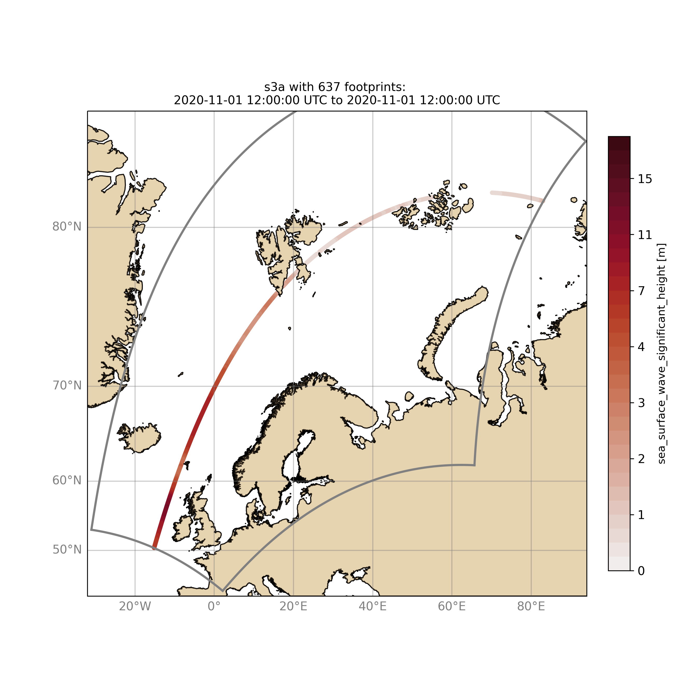
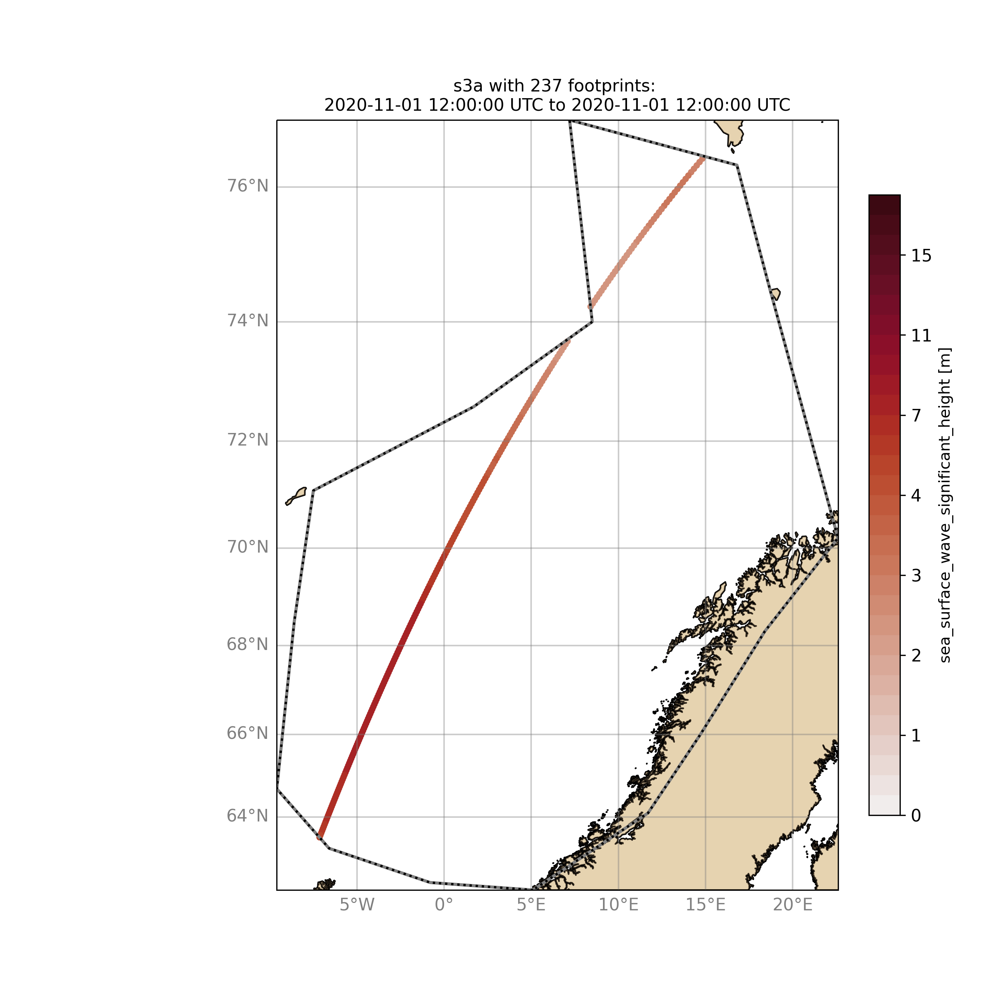
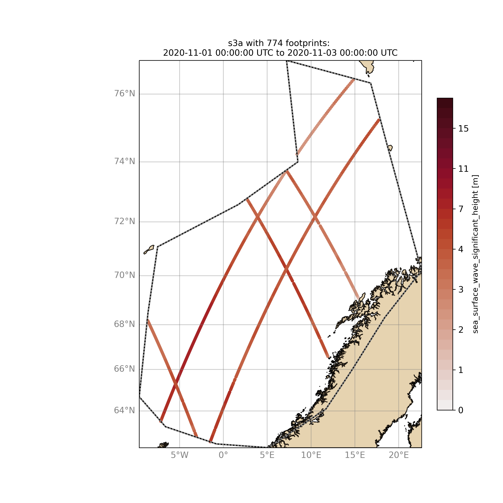
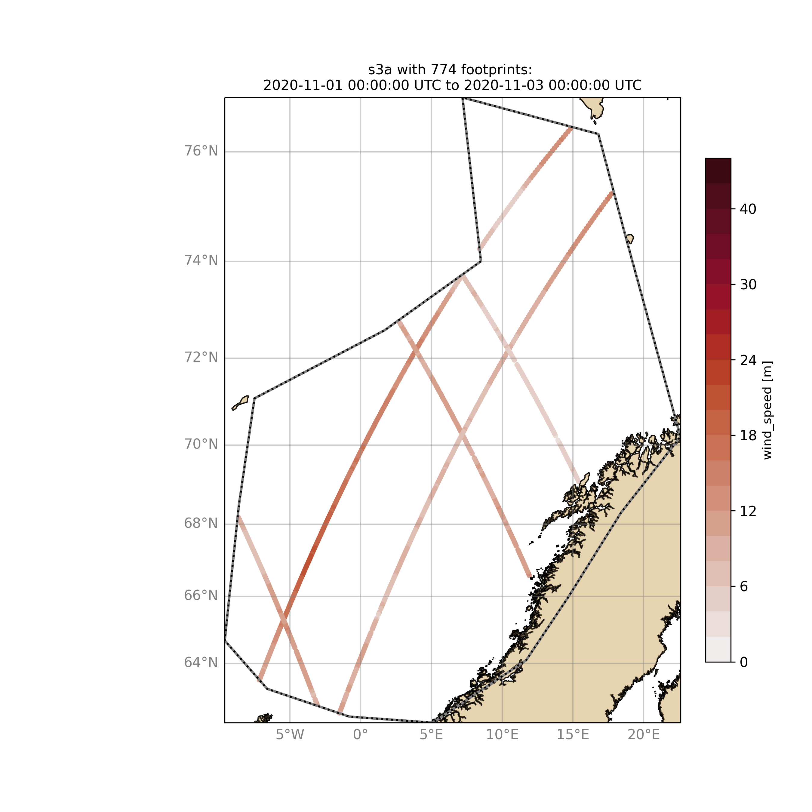
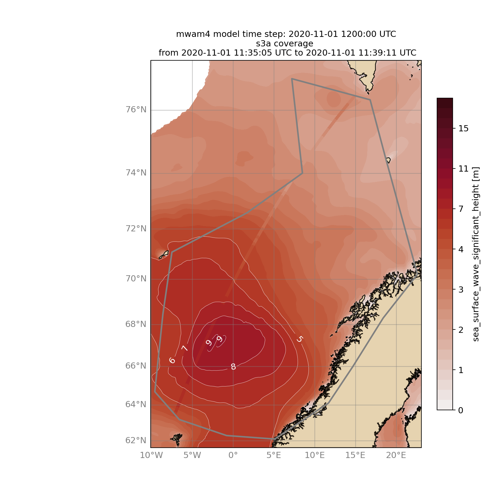

Quick look examples with wavyQuick
##################################

The script "wavyQuick.py" is designed to provide quick and easy access to information regarding satellite coverage and basic validation. Checkout the help:

.. code-block:: bash

   $ cd ~/wavy/apps/standalone
   $ ./wavyQuick.py -h

Browsing for satellite data of a given satellite mission and show footprints on map for a given time step and region:

For a model domain, here mwam4

.. code-block:: bash

   $ ./wavyQuick.py -sat s3a -reg mwam4 -sd 2020110112 --show

or for a user-defined polygon

.. code-block:: bash

   $ ./wavyQuick.py -sat s3a -reg NorwegianSea -sd 2020110112 --show

Browsing for satellite data and show footprints on map for time period would be the same approach simply adding an ending date:

.. code-block:: bash

   $ ./wavyQuick.py -sat s3a -reg NorwegianSea -sd 2020110100 -ed 2020110300 --show

The same could be done choosing 10m wind speed instead of significant wave height:

.. code-block:: bash

   $ ./wavyQuick.py -var U -sat s3a -reg NorwegianSea -sd 2020110100 -ed 2020110300 --show

The -sat argument can also be a list of satellites (adding the -l argument) or simply all available satellites:

.. code-block:: bash

   $ ./wavyQuick.py -sat list -l s3a,s3b,al -mod mwam4 -reg mwam4 -sd 2020110112 -lt 30 -twin 30 --col --show
   $ ./wavyQuick.py -sat all -mod mwam4 -reg mwam4 -sd 2020110112 -lt 30 -twin 30 --col --show

Now, dump the satellite data to a netcdf-file for later use:

.. code-block:: bash

   $ ./wavyQuick.py -sat s3a -reg mwam4 -sd 2020110100 -ed 2020110300 -dump /any/path/of/your/choice/test.nc

Browse for satellite data, collocate with wave model output and show footprints and model output for one time step and a given lead time (-lt 0) and time constraint (-twin 30):

.. code-block:: bash

   $ ./wavyQuick.py -sat s3a -reg NorwegianSea -mod mwam4 -sd 2020110112 -lt 0 -twin 30 --col --show

This results in a validation summary based on the collocated values:

.. code::

   # ---
   Validation stats
   # ---
   Correlation Coefficient: 0.95
   Mean Absolute Difference: 0.62
   Root Mean Squared Difference: 0.70
   Normalized Root Mean Squared Difference: 0.13
   Debiased Root Mean Squared Difference: 0.67
   Bias: 0.22
   Normalized Bias: 0.04
   Scatter Index: 12.71
   Mean of Model: 5.26
   Mean of Observations: 5.04
   Number of Collocated Values: 237

And of course the figure:

