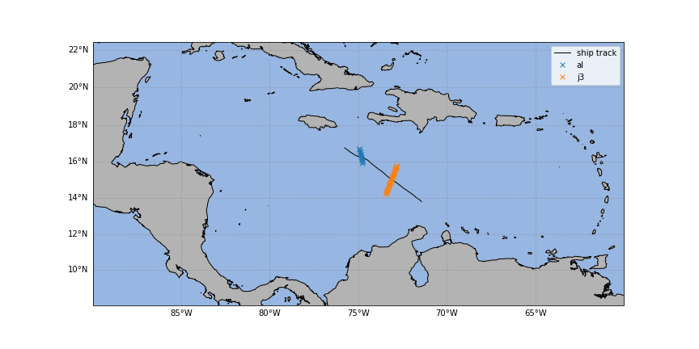
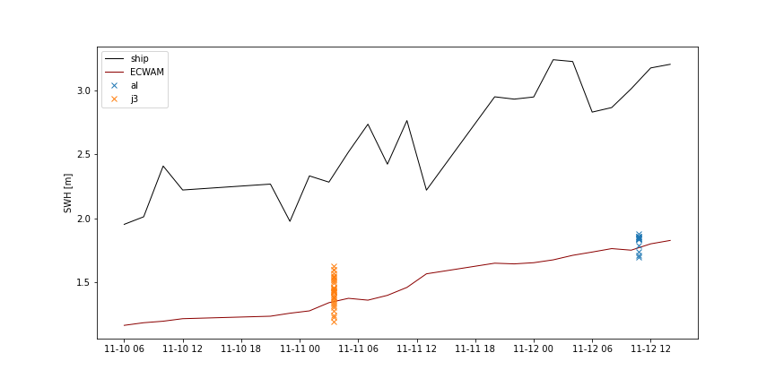

Vietnam Validation Workshop 2022
================================

.. note::

   The codes used for this workshop are from an older version of **wavy**. It can be adapted with the newest version of the package, however you can still find the version used for this workshop on `github <https://github.com/bohlinger/wavy/tree/595bd10afed4641f6add63e120052dfc98e8a26a>`_.

The following examples are tailored to the **wavy** Vietnam Validation Workshop 2022. Data are drawn from the `One Ocean Expedition <https://oneoceanexpedition.com/>`_.

1. Collocating satellite tracks with ship route
###############################################

The ship Statsraad Lehmkuhl is sailing around the world from August 2021 to  June 2023. An ultrasonic wavesensor is mounted at the bow of the ship to measure the wave heights along the sailing route. To compare the measurements with satellite altimetry we can use an extraction of the sailing route from November 2021 in the Caribbean. 

.. code-block:: python3 

   >>> dates =['2021-11-10 06:00:00', '2021-11-10 08:00:00', '2021-11-10 10:00:00', '2021-11-10 12:00:00', '2021-11-10 21:00:00', '2021-11-10 23:00:00','2021-11-11 01:00:00', '2021-11-11 03:00:00', '2021-11-11 05:00:00', '2021-11-11 07:00:00', '2021-11-11 09:00:00', '2021-11-11 11:00:00', '2021-11-11 13:00:00', '2021-11-11 20:00:00', '2021-11-11 22:00:00', '2021-11-12 00:00:00', '2021-11-12 02:00:00', '2021-11-12 04:00:00','2021-11-12 06:00:00', '2021-11-12 08:00:00', '2021-11-12 10:00:00', '2021-11-12 12:00:00', '2021-11-12 14:00:00']
   >>> lons = [-71.42327064, -71.56830483, -71.73049871, -71.86957682, -72.50222185, -72.6554126 , -72.86332153, -73.01326474, -73.17616195, -73.33622891, -73.49933545, -73.683851, -73.83428251, -74.29876106, -74.37572745, -74.54532721, -74.6921168 , -74.87270307, -75.09236661, -75.26189283, -75.42840085, -75.6120825 , -75.77318246]
   >>> lats = [13.80337168, 13.92372288, 14.02920137, 14.15243781, 14.58611255, 14.70380642, 14.85739353, 14.95343226, 15.06148897, 15.17723465, 15.32155999, 15.47488466, 15.5711294 , 15.9265756 , 16.00716254, 16.12903033, 16.19139845, 16.24826622, 16.3095132 , 16.40447855, 16.50764349, 16.63782876, 16.75236371]

The input need to be formulated in a dictionary such that **wavy** can parse it.

.. code-block:: python3

   >>> from wavy.utils import parse_date
   >>> dt = [parse_date(dates[i]) for i in range(len(dates))]
   >>> input_dict = {'datetime':list(dt),'longitude':list(lons),'latitude':list(lats)}

Add a region to the region_specs.yaml file for the collocation process to go faster. This is not a necessary step. The collocation can be done with region='global' aswell. 

.. code::

   Caribbean:
      llcrnrlon: -90.
      llcrnrlat: 10.
      urcrnrlon: -65.
      urcrnrlat: 20.

Now load the satellite class from wavy and run for the different satellite missions (s3a, s3b, cfo ,j3, c2, al, h2b)

.. code-block:: python3

   >>> from wavy.satmod import satellite_class as sc
   >>> sco = sc(twin=60, distlim=100, mission='j3', region='Caribbean', product='cmems_L3_NRT', poi=input_dict)

Then save the results with pickle. 

.. code-block:: python3

   >>> import pickle as pkl
   >>> with open('./sat_j3.pkl', 'wb') as fh:
   >>>    pkl.dump(sco, fh)

This can also be done with **wavy's** built-in function. 

.. code-block:: python3

   >>> sco.write_to_pickle('sat_j3.pkl')

2. Collocating model output with ship route
###########################################
In a similar way we can compare wave height from the wave sensor onboard Statsraad Lemkuhl with the ecmwf wave model ecwam. In addition to time and coordinates, we need input of observations and some name (nID). 

Observations of significant wave height from the extracted sailing route are.

.. code-block:: python3

   >>> obs = [1.95188614, 2.01089468, 2.40713171, 2.21996295, 2.26599615, 1.97531473, 2.32994075, 2.28145243, 2.51617129, 2.73359327, 2.42159943, 2.76188536, 2.21892547, 2.94729804, 2.9290969, 2.94588624, 3.23662259, 3.22262583, 2.82788103, 2.8632683, 3.01002524, 3.17253287, 3.20090333]

Alternatively, we can use an empty list as input. 

.. code-block:: python3

   >>> obs = np.empty([len(dt)])
   >>> obs[:] = np.NaN  

The input need to be formulated in a dictionary such that **wavy** can parse it.

.. code-block:: python3

   >>> input_dict = {'time':dt,'longitude':lons,'latitude':lats,'obs':obs,'nID':'OneOcean'}

Add the ecwam model to the model_specs.yaml file (if it is not added already).

.. code::

   ecwam_Hs:
       vardef:
           Hs: swh
           time: time
           lons: longitude
           lats: latitude
       path_template: "/path/to/your/files/"
       file_template: "swh_be_global_0125_%Y%m%d_%H.nc"
       init_times: [0,12]
       init_step: 12
       date_incr: 1
       proj4: "+proj=longlat +a=6367470 +e=0 +no_defs"
       grid_date: 2021-11-26 00:00:00

Import **wavy**'s collocation class and add some collocation specifications.

.. code-block:: python3

   >>> from wavy.collocmod import collocation_class as cc
   >>> cco = cc(twin=60,distlim=100,model='ecwam_Hs',varalias='Hs',poi=input_dict)

Then save the results with pickle.      

.. code-block:: python3

   >>> cco.write_to_pickle('model.pkl')

A quick validation can be performed using the validationmod. 

.. code-block:: python3

   >>> val_dict = cco.validate_collocated_values()
  
   # ---
   Validation stats
   # ---
   Correlation Coefficient: 0.88
   Mean Absolute Difference: 1.14
   Root Mean Squared Difference: 1.16
   Normalized Root Mean Squared Difference: 0.44
   Debiased Root Mean Squared Difference: 0.24
   Bias: -1.14
   Normalized Bias: -0.43
   Scatter Index: 16.15
   Model Activity Ratio: 0.54
   Mean of Model: 1.49
   Mean of Observations: 2.63
   Number of Collocated Values: 23

3. Comparing model, satellite and observations from the ship
############################################################
Now that the data is retrieved, we can compare the output from model and satellite to the observations from the ship. 

First read the satellite data. For the chosen collocation specifications only j3 and al is available.

.. code-block:: python3

   >>> import pickle as pkl
   >>> names = ['j3', 'al']
   >>> data = {}
   >>> for i in names:
   >>>    with open("sat_{}".format(i)+".pkl", "rb") as fh:
   >>>       data["{}".format(i)] = pkl.load(fh) 

Then read the model data.

.. code-block:: python3

   >>> with open("model.pkl", "rb") as fh:
   >>>    model = pkl.load(fh)

Make a map of the retrieved satellite data and the ship track. 

.. code-block:: python3

   >>> from cartopy import crs
   >>> import cartopy.feature as cfeatures
   >>> import matplotlib.pyplot as plt
   >>> fig=plt.figure(figsize=(12,6))
   >>> ax=plt.axes(projection=crs.Mercator())
   >>> ax.coastlines()
   >>> ax.add_feature(cfeatures.LAND,edgecolor='k',color=(.7 ,.7 ,.7),zorder=1)
   >>> ax.add_feature(cfeatures.OCEAN)
   >>> ax.set_extent([-90,-60,8,22])
   >>> g1=ax.gridlines(draw_labels=True,linewidth=1,color='grey',alpha=0.3,linestyle='--')
   >>> g1.top_labels = False
   >>> g1.right_labels = False
   >>> plt.plot(model.vars['obs_lons'], model.vars['obs_lats'],transform=crs.PlateCarree(),linewidth=1,label='ship track',color='k')
   >>> for i in names:
   >>>    plt.plot(data["{}".format(i)].vars['longitude'][:],data["{}".format(i)].vars['latitude'][:],transform=crs.PlateCarree(),linestyle="",marker='x',label=i)
   >>> plt.legend()

Make a time series to compare the output visually.

.. code-block:: python3

   >>> fig=plt.figure(figsize=(12,6))
   >>> plt.plot(model.vars['datetime'], model.vars['obs_values'],linewidth=1,color='k',label='ship')
   >>> plt.plot(model.vars['datetime'], model.vars['model_values'],linewidth=1,color='darkred',label='ECWAM')
   >>> for i in names:
   >>>    plt.plot(data["{}".format(i)].vars['datetime'],data["{}".format(i)].vars['sea_surface_wave_significant_height'][:],linestyle="",marker='x',label=i)
   >>> plt.ylabel('SWH [m]')
   >>> plt.legend()

