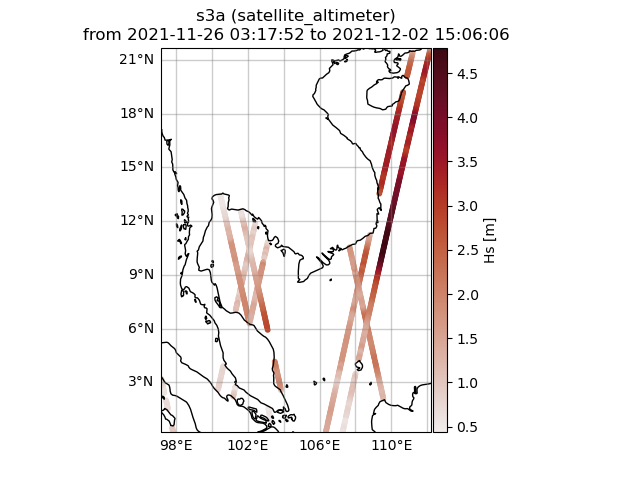
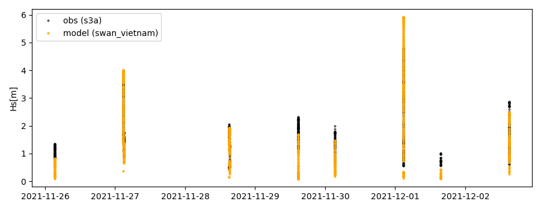
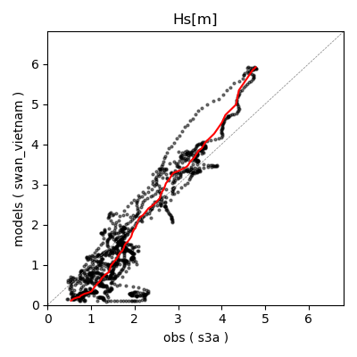

Vietnam Validation Workshop 2022 #2
===================================

.. note::

   The codes used for this workshop are from an older version of **wavy**. It can be adapted with the newest version of the package, however you can still find the version used for this workshop on `github <https://github.com/bohlinger/wavy/tree/595bd10afed4641f6add63e120052dfc98e8a26a>`_.

The following examples are tailored to the 4. **wavy** Vietnam Validation Workshop and second workshop in 2022. While the first part in 2022 was in spring and dedicated to trajectories, this workshop will focus on some simple examples that can be used as python code snippets in your workflow.

1. **wavy** config files
########################
For this workshop you will need the following config files:

.. code-block:: bash

   collocation_specs.yaml.default  region_specs.yaml.default
   satellite_specs.yaml.default    quicklook_specs.yaml.default
   model_specs.yaml.default        validation_specs.yaml.default

Create a new project directory. Establish an .env file such that **wavy** knows where to find the config files it should use. This could look like:

.. code-block:: bash

        :~$ mkdir ws22_wavy
        :~/ws22_wavy$ mkdir config

Now copy the needed config default files from wavy/wavy/config to this directory and remove the suffix *.default*. The result would look like:

.. code-block:: bash

        :~/ws22_wavy/config$ ls
        collocation_specs.yaml  region_specs.yaml
        model_specs.yaml        satellite_specs.yaml
        quicklook_specs.yaml    validation_specs.yaml

This is the structure of your project directory:

.. code-block:: bash

        :~/ws22_wavy$ ls -la
        total 16
        drwxrwxr-x  3 patrikb patrikb 4096 Nov 14 09:04 .
        drwx------ 79 patrikb patrikb 4096 Nov 14 09:06 ..
        drwxrwxr-x  2 patrikb patrikb 4096 Nov 14 09:10 config
        -rwxr-xr-x  1 patrikb patrikb   44 Nov 14 09:04 .env

Where your *.env*-file needs to point to this config folder like in the following example for my username *patrikb*:

.. code-block:: bash

        :~/ws22_wavy$ cat .env
        WAVY_CONFIG=/home/patrikb/ws22_wavy/config/

The main changes that will occur in the config files during this workshop are:

   * adjusting the path
   * adding your model

2. Download L3 satellite altimetry data
#######################################

L3 satellite data is obtained from Copernicus with the product identifier WAVE_GLO_WAV_L3_SWH_NRT_OBSERVATIONS_014_001. User credentials are required for this task. So before you can start you have to get a Copernicus account (free of costs). Prepare access to Copernicus products. Enter your account credentials into the .netrc-file. The .netrc should be located in your home not being too permissive like:

.. code::

        :~$ ls -lh .netrc
        -rwx------ 1 patrikb patrikb 675 Oct 19 07:54 .netrc

Your .netrc should look something like:

.. code::

   machine nrt.cmems-du.eu    login {USER}  password {PASSWORD}

Adjust the satellite config file called *satellite_specs.yaml*. Remember, this is the file you copied to *~/ws22_wavy/config*. It should include the following section and could look like:

.. code-block:: yaml

   --- # specifications for satellite missions

   cmems_L3_NRT:
        mission:
            s3a: s3a
            s3b: s3b
            c2: c2
            al: al
            j3: j3
            h2b: h2b
            cfo: cfo
        dst:
            path_template: /home/patrikb/tmp_altimeter/L3/mission
            file_template: "varalias_mission_region_\
                            %Y%m%d%H%M%S_%Y%m%d%H%M%S.nc"
            strsub: ['varalias','mission','region']
            file_date_incr: m
        src:
            path_template: "/Core/\
                    WAVE_GLO_WAV_L3_SWH_NRT_OBSERVATIONS_014_001/\
                    dataset-wav-alti-l3-swh-rt-global-mission/%Y/%m/"
            server: "nrt.cmems-du.eu"
            strsub: ['mission']
        misc:
        vardef: # varalias: varname
            Hs: VAVH
            U: WIND_SPEED
        processing_level: L3
        provider: cmems

Amend the path_template line and correct it according to the directory you want to store satellite data. For my directory the line is:

.. code-block:: yaml

   cmems_L3:
      dst:
         path_template: /home/patrikb/tmp_altimeter/L3/mission

You can proceed now and download L3 data using the wavyDownload.py script:

.. code-block:: bash

   $ cd ~/wavy/apps/standalone

To get help check ...

.. code-block:: bash

   $ ./wavyDownload.py -h

... then download some satellite altimeter data:

.. code-block:: bash

   $ ./wavyDownload.py -sat s3a -sd 2020110100 -ed 2020111000 -product cmems_L3_NRT -nproc 4

*-nproc 4* means 4 simultaneous downloads. This can be adjusted according to resources and needs. You can find the downloaded files in your chosen download directory. Now download some other dates for later use.

.. code-block:: bash

   $ ./wavyDownload.py -sat s3a -sd 2021112600 -ed 2021120300 -product cmems_L3_NRT -nproc 4

3. Read satellite data
######################
Once the satellite data is downloaded one can access and read the data for further use with **wavy**. Let's have a look at some examples in a python script.

In python L3-data can be read by importing the satellite_class, choosing a region of interest, the variable of interest (Hs or U), the satellite mission, which product should be used, and whether a time window should be used as well as a start and possibly an end date. This could look like:

.. code-block:: python3

   >>> from wavy.satmod import satellite_class as sc
   >>> region = 'NorwegianSea'
   >>> varalias = 'Hs' # default
   >>> mission = 's3a' # default
   >>> product = 'cmems_L3_NRT' # default
   >>> twin = 30 # default
   >>> sd = "2020-11-1" # can also be datetime object
   >>> ed = "2020-11-10" # not necessary if twin is specified
   >>> sco = sc(sdate=sd,edate=ed,region=region)

This would result in a satellite_class object and the following output message::

   # -----
    ### Initializing satellite_class object ###
        
   Requested time frame: 2020-11-01 00:00:00 - 2020-11-10 00:00:00
   Chosen time window is: 30 min
   No download initialized, checking local files

    ## Find files ...
   path_local is None -> checking config file
   /home/patrikb/tmp_altimeter/L3/s3a/2020/10
   /home/patrikb/tmp_altimeter/L3/s3a/2020/11
   89 valid files found
        
    ## Read files ...
   Get filevarname for
   stdvarname: sea_surface_wave_significant_height
   varalias: Hs
   !!! standard_name:  sea_surface_wave_significant_height  is not unique !!!
   The following variables have the same standard_name:
   ['VAVH', 'VAVH_UNFILTERED']
   Searching *_specs.yaml config file for definition
   Variable defined in *_specs.yaml is:
   Hs = VAVH
   100%|██████████████████████████████████████████| 89/89 [00:00<00:00, 214.94it/s]
   Concatenate ...
   ... done concatenating
   Total:  400391  footprints found
   Apply region mask
   Specified region: NorwegianSea
    --> Bounded by polygon:
   lons: [5.1, -0.8, -6.6, -9.6, -8.6, -7.5, 1.7, 8.5, 7.2, 16.8, 18.7, 22.6, 18.4, 14.7, 11.7, 5.1]
   lats: [62.1, 62.3, 63.2, 64.7, 68.5, 71.1, 72.6, 74.0, 76.9, 76.3, 74.5, 70.2, 68.3, 66.0, 64.1, 62.1]
   Values found for chosen region and time frame.
   Region mask applied
   For chosen region and time:  3551 footprints found
        
    ## Summary:
   3551 footprints retrieved.
   Time used for retrieving satellite data: 0.64 seconds
        
    ### Satellite object initialized ###
   # -----

Investigating the satellite_object you will find something like::

        >>> sco.
        sco.edate             sco.processing_level  sco.twin
        sco.get_item_child(   sco.product           sco.units
        sco.get_item_parent(  sco.provider          sco.varalias
        sco.label             sco.quicklook(        sco.varname
        sco.mission           sco.region            sco.vars
        sco.obstype           sco.sdate             sco.write_to_nc(
        sco.path_local        sco.stdvarname        sco.write_to_pickle(

With the retrieved variables in sco.vars::

   >>> sco.vars.keys()
   dict_keys(['sea_surface_wave_significant_height', 'time', 'time_unit', 'latitude', 'longitude', 'datetime', 'meta'])

Using the quicklook function you can quickly visualize the data you have retrieved::

   >>> sco.quicklook(ts=True) # for time series
   >>> sco.quicklook(m=True) # for a map
   >>> sco.quicklook(a=True) # for all

You can dump your data using *sco.write_to_nc* or *sco.write_to_pickle* like::

   >>> sco.write_to_nc('/home/patrikb/ws22_wavy/data/testfile.nc')
   Dump data to netCDF4 file
   Dump data to file:  /home/patrikb/ws22_wavy/data/testfile.nc

Exercise:
*********

Define your own region in *region_specs.yaml* and retrieve satellite data for this region.

4. access/read model data
#########################
Model output can be accessed and read using the modelmod module. The modelmod config file model_specs.yaml needs adjustments if you want to include a model that is not present as default. Given that the model output file you would like to read follows the cf-conventions and standard_names are unique, the minimum information you have to provide are usually:

.. code-block:: yaml

   modelname:
       path_template:
       file_template:
       init_times: []
       init_step:

Often there are ambiguities due to the multiple usage of standard_names. Any such problem can be solved here in the config-file by adding the specified variable name like:

.. code-block:: yaml

    vardef:
        Hs: VHM0
        time: time
        lons: lon
        lats: lat

The variable aliases (left hand side) need to be specified in the variable_info.yaml. Basic variables are already defined. Adding your model output files to wavy means to add something like:

.. code-block:: yaml

    ecwam_vietnam:
        vardef:
            Hs: significant_wave_height
            time: time
            lons: longitude
            lats: latitude
        path_template: "/home/patrikb/Documents/Vietnam/%Y/"
        file_template: "vietnam_wave_%Y%m%d_%H.nc"
        init_times: [0,12]
        init_step: 12
        date_incr: 3
        proj4: "+proj=longlat +a=6367470 +e=0 +no_defs"
        grid_date: 2021-11-26 00:00:00

    ecifs_vietnam:
        vardef:
            ux: u10m
            vy: v10m
            time: time
            lons: lon
            lats: lat
        path_template: "/home/patrikb/Documents/Vietnam/%Y/"
        file_template: "ECIFS%Y%m%d%H.nc"
        init_times: [0,12]
        init_step: 12
        date_incr: 6
        proj4: "+proj=longlat +a=6367470 +e=0 +no_defs"
        grid_date: 2021-11-26 00:00:00

    swan_vietnam:
        vardef:
            Hs: hs
            time: time
            lons: longitude
            lats: latitude
        path_template: "/home/patrikb/Documents/Vietnam/%Y/"
        file_template: "SWAN%Y%m%d%H.nc"
        init_times: [0,12]
        init_step: 12
        date_incr: 3
        grid_date: 2021-11-26 00:00:00
        proj4: "+proj=longlat +a=6367470 +e=0 +no_defs"

Now you can proceed to load your model in wavy. Start python and type:

.. code-block:: python3

   >>> from wavy.modelmod import model_class as mc
   >>> model = 'swan_vietnam'
   >>> varalias = 'Hs'
   >>> sd = "2021-11-26 12"
   >>> mco = mc(model=model,sdate=sd,varalias=varalias) # one time slice
   >>> mco_lt = mc(model=model,sdate=sd,varalias=varalias,leadtime=12) # time slice with lead time

Whenever the keyword "leadtime" is None, a best estimate is assumed and retrieved. The output will be something like::

   >>> mco.
   mco.edate             mco.leadtime          mco.varalias
   mco.fc_date           mco.model             mco.varname
   mco.filestr           mco.quicklook(        mco.vars
   mco.get_item_child(   mco.sdate             mco.write_to_pickle(
   mco.get_item_parent(  mco.stdvarname        
   mco.label             mco.units 

   >>> mco.vars.keys()
   dict_keys(['longitude', 'latitude', 'time', 'datetime', 'time_unit', 'sea_surface_wave_significant_height', 'meta', 'leadtime'])

For the model_class objects a quicklook function exists to depict a certain time step of what you loaded::

   >>> mco.quicklook() # for a map

Or, since there is only a map plot for model_class object, the following is equivalent::

   >>> mco.quicklook(m=True) # for a map
   >>> mco.quicklook(a=True) # for a map

5. Collocating model and observations
#####################################
One main focus of **wavy** is to ease the collocation of observations and numerical wave models for the purpose of model validation. For this purpose there is the config-file collocation_specs.yaml where you can specify the name and path for the collocation file to be dumped if you wish to save them. If you have available the necessary satellite data and model data you can proceed with collocation:

Collocation of satellite and wave model
****************************************

.. code-block:: python3

   >>> from wavy.satmod import satellite_class as sc
   >>> from wavy.collocmod import collocation_class as cc

   >>> model = 'swan_vietnam'
   >>> mission = 's3a'
   >>> varalias = 'Hs'
   >>> sd = "2021-11-26 00"
   >>> ed = "2021-12-03 00"
   >>> sco = sc(sdate=sd,edate=ed,region=model,mission=mission,varalias=varalias)
   >>> cco = cc(model=model,obs_obj_in=sco,distlim=6,date_incr=1)

*distlim* is the distance limit for collocation in *km* and date_incr is the time step increase in hours. One can also add a keyword for the collocation time window. The default is +-30min which is equivalent to adding *twin=30*.

Using the quicklook function again (*cco.quicklook(a=True)*) will enable three plots this time, a time series plot (*ts=True*), a map plot (*m=True*), and a scatter plot (*sc=True*).

6. Validate the collocated time series
#######################################
Having collocated a quick validation can be performed using the validationmod. validation_specs.yaml can be adjusted.

.. code-block:: python3

   >>> val_dict = cco.validate_collocated_values()

   # ---
   Validation stats
   # ---
   Correlation Coefficient: 0.93
   Mean Absolute Difference: 0.51
   Root Mean Squared Difference: 0.66
   Normalized Root Mean Squared Difference: 0.29
   Debiased Root Mean Squared Difference: 0.64
   Bias: -0.17
   Normalized Bias: -0.08
   Scatter Index: 34.77
   Model Activity Ratio: 1.41
   Mean of Model: 1.85
   Mean of Observations: 2.01
   Number of Collocated Values: 1277

The entire validation dictionary will then be in val_dict.
