Oslo **wavy** workshop 2024
===========================

The following examples are tailored to the **wavy** Workshop. This workshop will focus on some simple examples that can be used as python code snippets in your workflow.

0. checklist **wavy** installation
##################################

    * did you add your **wavy** root directory to $PYTHONPATH?
    * is **wavy** activated? (conda activate wavy)

1. **wavy** config files
########################

For this workshop you will need the following config files:

.. code::

   satellite_cfg.yaml.default   insitu_cfg.yaml.default
   model_cfg.yaml.default        
   
   
Create a new project directory. Establish an .env file such that **wavy** knows where to find the config files it should use. This could look like:

.. code-block:: bash

        :~$ mkdir ws24_wavy
        :~$ cd ws24_wavy
        :~/ws24_wavy$ touch .env
        :~/ws24_wavy$ mkdir config

Now copy the needed config default files from wavy/wavy/config to this directory and remove the suffix *.default*. The result would look like:

.. code-block:: bash

        :~/ws24_wavy/config$ ls
        insitu_cfg.yaml     satellite_cfg.yaml    model_cfg.yaml   

This is the structure of your project directory:

.. code-block:: bash

        :~/ws24_wavy$ ls -la
        total 16
        drwxrwxr-x  3 patrikb patrikb 4096 Nov 14 09:04 .
        drwx------ 79 patrikb patrikb 4096 Nov 14 09:06 ..
        drwxrwxr-x  2 patrikb patrikb 4096 Nov 14 09:10 config
        -rwxr-xr-x  1 patrikb patrikb   44 Nov 14 09:04 .env

Where your *.env*-file needs to point to this config folder like in the following example for my username *patrikb*:

.. code-block:: bash

        :~/ws24_wavy$ cat .env
        WAVY_CONFIG=/home/patrikb/ws24_wavy/config/
        WAVY_DIR=/home/patrikb/wavy/

Finally, the same .env file has to be copied to the wavy root directory, ~/wavy. 

2. Download L3 satellite altimetry data
#######################################

L3 satellite data is obtained from Copernicus with the product identifier WAVE_GLO_WAV_L3_SWH_NRT_OBSERVATIONS_014_001. User credentials are required for this task. So before you can start you have to get a Copernicus account (free of costs). Prepare access to Copernicus products. Enter your account credentials into the .netrc-file. The .netrc should be located in your home not being too permissive like:

.. code::

        :~$ ls -lh .netrc
        -rwx------ 1 patrikb patrikb 675 Oct 19 07:54 .netrc

Your .netrc should look something like:

.. code::

   machine nrt.cmems-du.eu    login {USER}  password {PASSWORD}

Adjust the satellite config file called *satellite_cfg.yaml*. Remember, this is the file you copied to *~/ws24_wavy/config*. It should include the following section and could look like:

.. code-block:: yaml

   --- # specifications for satellite missions

   cmems_L3_NRT:
       # mandatory
       name:
           s3a: s3a
           s3b: s3b
           c2: c2
           j3: j3
           h2b: h2b
           al: al
           cfo: cfo
           s6a: s6a
       # mandatory when downloading
       # where to store downloaded data
       download:
           ftp: # downloading method
               src_tmplt: "/Core/\
                           WAVE_GLO_PHY_SWH_L3_NRT_014_001/\
                           cmems_obs-wave_glo_phy-swh_nrt_name-l3_PT1S/\
                           %Y/%m/"
               trgt_tmplt: /home/patrikb/tmp_altimeter/L3/name/%Y/%m
               path_date_incr_unit: 'm'
               path_date_incr: 1
               search_str: '%Y%m%dT'
               strsub: ['name']
               server: "nrt.cmems-du.eu"
       # optional: where to read from
       #           can be defined directly when calling wavy
       wavy_input:
           src_tmplt: /home/patrikb/tmp_altimeter/L3/name/%Y/%m
           fl_tmplt: "varalias_name_region_\
                           %Y%m%d%H%M%S_%Y%m%d%H%M%S.nc"
           strsub: ['name']
           path_date_incr_unit: 'm'
           path_date_incr: 1
       # optional: where to write to
       #           can be defined directly when calling wavy
       wavy_output:
           trgt_tmplt: /home/patrikb/tmp_altimeter/L3/name/%Y/%m
           fl_tmplt: "varalias_name_region_\
                           %Y%m%d%H%M%S_%Y%m%d%H%M%S.nc"
           strsub: ['varalias','name','region']
           file_date_incr: m
       # optional, if not defined the class default is used
       reader: read_local_ncfiles
       collector: get_remote_files_cmems
       # optional, needs to be defined if not cf and in variable_info.yaml
       vardef:
           Hs: VAVH
           U: WIND_SPEED
       coords:
       # optional, info that can be used by class functions
       misc:
           processing_level:
           provider:
           obs_type:
       # optional, to ease grouping
       tags:
       
Amend the path_template line and correct it according to the directory you want to store satellite data. For my directory the line is:

.. code-block:: yaml

   cmems_L3:
      ftp:
         trgt_tmplt: /home/patrikb/tmp_altimeter/L3/name

You can proceed now and download L3 data using the wavyDownload.py script:

.. code-block:: bash

   $ cd ~/wavy/apps/standalone

To get help check ...

.. code-block:: bash

   $ ./wavyDownload.py --help

... then download some satellite altimeter data:

.. code-block:: bash

   $ ./wavyDownload.py --nID cmems_L3_NRT --name s3a --sd 2023020100 --ed 2023020200 --nproc 4

*-nproc 4* means 4 simultaneous downloads. This can be adjusted according to resources and needs. You can find the downloaded files in your chosen download directory. Now download some other dates for later use.

3. Read satellite data
######################
Once the satellite data is downloaded one can access and read the data for further use with **wavy**. Let's have a look at some examples in a python script.

In python L3-data can be read by importing the satellite_class, choosing a region of interest, the variable of interest (Hs or U), the satellite mission, which product should be used, and whether a time window should be used as well as a start and possibly an end date. This could look like:

.. code-block:: python3

   >>> from wavy.satellite_module import satellite_class as sc
   >>> # settings
   >>> region = 'global'
   >>> varalias = 'Hs'  # default
   >>> name = 's3a'
   >>> nID = 'cmems_L3_NRT'
   >>> twin = 30  # default
   >>> sd = "2023-2-1 11"  # can also be datetime object
   >>> ed = "2023-2-1 12"  # not necessary if twin is specified
   >>> # retrieval
   >>> sco = sc(sd=sd, ed=ed, region=region, nID=nID, name=name)
   >>> sco = sco.populate()
   
This would result in a satellite_class object and the following output message::

   # ----- 
    ### Read files and populate satellite_class object
    ## Find and list files ...
   path is None -> checking config file
   Object is iterable
   8 valid files found
   source template: /home/patrikb/tmp_altimeter/L3/name/%Y/%m

   Checking variables..
    Get filevarname for 
   stdvarname: sea_surface_wave_significant_height 
   varalias: Hs
    !!! standard_name:  sea_surface_wave_significant_height  is not unique !!! 
   The following variables have the same standard_name:
    ['VAVH', 'VAVH_UNFILTERED']
    Searching *_cfg.yaml config file for definition
    Variable defined in *_cfg.yaml is:
   Hs = VAVH

   Choosing reader..
   Chosen reader: satellite_readers.read_local_ncfiles

   Reading..
   Reading 10 chunks of files with chunk size 1
   Total of 8 files
   100%|██████████████████████████████████████████████████████████| 9/9 [00:00<00:00, 56.61it/s]
    changing variables to aliases
    Get filevarname for 
   stdvarname: sea_surface_wave_significant_height 
   varalias: Hs
    !!! standard_name:  sea_surface_wave_significant_height  is not unique !!! 
   The following variables have the same standard_name:
    ['VAVH', 'VAVH_UNFILTERED']
    Searching *_cfg.yaml config file for definition
    Variable defined in *_cfg.yaml is:
   Hs = VAVH
      VAVH is alreade named correctly and therefore not adjusted
    Get filevarname for 
   stdvarname: time 
   varalias: time
    Get filevarname for 
   stdvarname: longitude 
   varalias: lons
      lons is alreade named correctly and therefore not adjusted
    Get filevarname for 
   stdvarname: latitude 
   varalias: lats
      lats is alreade named correctly and therefore not adjusted
    enforcing lon max min = -180/180
    
    ## Summary:
   5211 footprints retrieved.
   Time used for retrieving data:
   0.17 seconds
    
    ### satellite_class object populated ###
   # ----- 

Note that we first initialized the satellite_class object with the following line: 

.. code-block:: python3

   >>> sco = sc(sd=sd, ed=ed, region=region, nID=nID, name=name)
   
And we then populated it with data using the populate method: 

.. code-block:: python3

   >>> sco = sco.populate()

If you have not downloaded satellite data with wavyDownload.py, you can also initialize 
a satellite object with the same parameters you would use for the import, and use the download method. 
Note that you still need to configure the *satellite_cfg.yaml* accordingly: 

.. code-block:: python3

   >>> sco = sc(sd=sd, ed=ed, region=region, nID=nID, name=name)
   >>> sco.download()

Another option is to give the path directly to the download function:

.. code-block:: python3

   >>> sco.download(path='.....')

Investigating the satellite_object you will find something like::

        >>> sco.
        sco.edate             sco.processing_level  sco.twin
        sco.get_item_child(   sco.product           sco.units
        sco.get_item_parent(  sco.provider          sco.varalias
        sco.label             sco.quicklook(        sco.varname
        sco.mission           sco.region            sco.vars
        sco.obstype           sco.sdate             sco.write_to_nc(
        sco.path_local        sco.stdvarname        sco.write_to_pickle(

With the retrieved variables in sco.vars::

   >>> sco.vars
   <xarray.Dataset>
   Dimensions:  (time: 5211)
   Coordinates:
     * time     (time) datetime64[ns] 2023-02-01T10:33:27 ... 2023-02-01T12:26:16
   Data variables:
       Hs       (time) float32 1.145 0.999 0.826 0.763 ... 1.368 1.379 1.38 1.384
       lons     (time) float64 -149.9 -150.0 -150.2 -150.4 ... 150.0 150.0 150.0
       lats     (time) float64 -76.35 -76.31 -76.26 -76.22 ... -36.99 -36.93 -36.87
   Attributes:
       title:    wavy dataset

Using the quicklook function you can quickly visualize the data you have retrieved::

   >>> sco.quicklook(ts=True) # for time series
   >>> sco.quicklook(m=True) # for a map
   >>> sco.quicklook(a=True) # for all

.. |ex1| image:: ./oslo_ws24_sat_ts.png
   :scale: 50
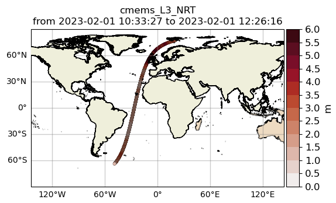

+-------------------+------------------+
| |ex1|             | |ex2|            |
|                   |                  |
+-------------------+------------------+

Exercise:
*********

Define your own region in *region_cfg.yaml* and retrieve satellite data for this region.

4. access/read in-situ data
###########################

In-situ observations can also be imported using the insitu_module module. You can add new sources of in-situ data using the *insitu_cfg.yaml* file, just like in the *satellite_cfg.yaml*.

.. code-block:: python3

   >>> from wavy.insitu_module import insitu_class as ic
   >>> varalias = 'Hs'
   >>> sd = "2023-12-2 00"
   >>> ed = "2023-12-5 00"
   >>> nID = 'D_Breisundet_wave'
   >>> sensor = 'wavescan'
   >>> ico = ic(nID=nID, sd=sd, ed=ed, varalias=varalias, name=sensor)
   >>> ico = ico.populate()

You can have a look at the obtained time series:

.. code-block:: python3

   >>> sco.quicklook(ts=True)

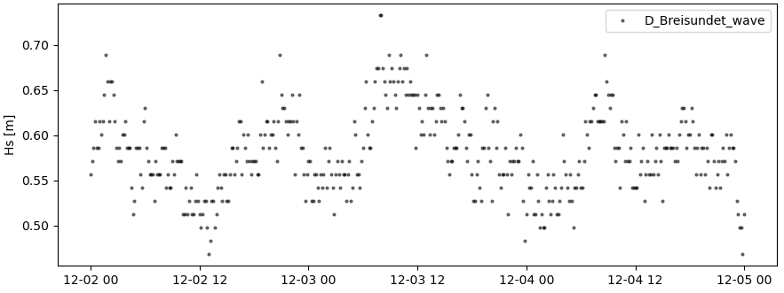

5. access/read model data
#########################
Model output can be accessed and read using the model_module module. The model_module config file model_cfg.yaml needs adjustments if you want to include a model that is not present as default. 

You can then import model data as follows: 

.. code-block:: python3

   >>> from wavy.model_module import model_class as mc
   >>> nID = 'ww3_4km'  # default
   >>> varalias = 'Hs'  # default
   >>> sd = "2023-6-1"
   >>> ed = "2023-6-1 01"
   >>> mco = mc(nID=nID, sd=sd).populate()  # one time slice
   >>> mco_p = mc(nID=nID, sd=sd, ed=ed).populate()  # time period

And again it is possible to visualize the data: 

.. code-block:: python3

   >>> sco.quicklook(m=True)
   
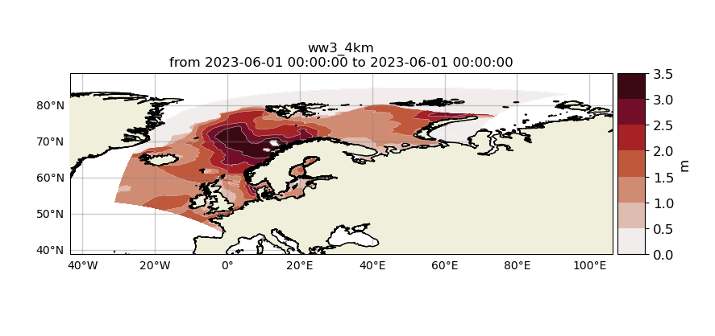

6. Collocating model and observations
#####################################
One main focus of **wavy** is to ease the collocation of observations and numerical wave models for the purpose of model validation. If you have available the necessary satellite data and model data you can proceed with collocation:

Collocation of satellite and wave model
****************************************

.. code-block:: python3

   >>> from wavy.satellite_module import satellite_class as sc
   >>> from wavy.collocation_module import collocation_class as cc
   >>> sd = "2023-2-1 11"
   >>> ed = "2023-2-1 11"
   >>> name = 's3a'
   >>> varalias = 'Hs'
   >>> twin = 29  # in minutes
   >>> nID = 'cmems_L3_NRT'
   >>> model = 'ww3_4km'
   
   >>> # initialize satellite_object
   >>> sco = sc(sd=sd, ed=ed, nID=nID, name=name,
   >>>          varalias=varalias, twin=twin)
   
   >>> # read data
   >>> sco = sco.populate()
   
   >>> # crop to region
   >>> sco = sco.crop_to_region(model)
   
   >>> # collocate
   >>> cco = cc(oco=sco, model=model, leadtime='best', distlim=6)

*distlim* is the distance limit for collocation in *km* and date_incr is the time step increase in hours. One can also add a keyword for the collocation time window. The default is +-30min which is equivalent to adding *twin=30*. In this case ERA only had 6h time steps which makes it a bit more unlikely that satellite crossings and model time steps coincide. Increasing *twin* helps, however, it means we assume quasi-stationarity for this time period.

Using the quicklook function again (*cco.quicklook(a=True)*) will enable three plots this time, a time series plot (*ts=True*), a map plot (*m=True*), and a scatter plot (*sc=True*).

.. code-block:: python3

   >>> cco.quicklook(ts=True)

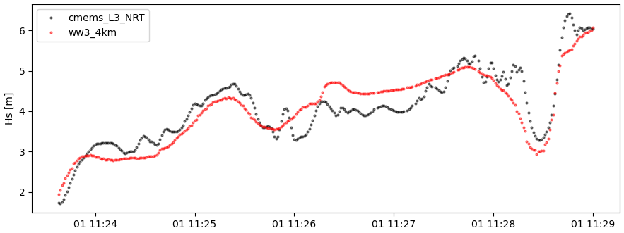

7. Validate the collocated time series
#######################################
Having collocated a quick validation can be performed using the validationmod. *validation_metrics.yaml* can be adjusted.

.. code-block:: python3

   >>> val_dict = cco.validate_collocated_values()

   # ---
   Validation stats
   # ---
   Correlation Coefficient: 0.89
   Mean Absolute Difference: 0.35
   Root Mean Squared Difference: 0.41
   Normalized Root Mean Squared Difference: 0.10
   Debiased Root Mean Squared Difference: 0.41
   Bias: -0.05
   Normalized Bias: -0.01
   Scatter Index: 10.03
   Model Activity Ratio: 0.98
   Mean of Model: 4.02
   Mean of Observations: 4.08
   Number of Collocated Values: 317

The entire validation dictionary will then be in val_dict.

8. Regridding data
##################
Once satellite observations are retrieved or even collocated model data are available wavy can process and display this data in custom grids for your region of interest.

Gridding of satellite data
**************************

Let us try it with satellite data first. Note that here we import the files using *path* parameter in 
*sco.populate()*. This allows to import all files from a given directory. Again, the format of the file must 
be defined in *satellite_cfg.yml*. 

.. code-block:: python3

   >>> from wavy.satellite_module import satellite_class as sc

   >>> path_to_files = '/home/patrikb/wavy/tests/data/L3/s3a/'
   >>> sd = '2022-2-1'
   >>> ed = '2022-2-2'
   >>> region = 'NordicSeas'
   >>> name = 's3a'
   >>> nID = 'cmems_L3_NRT'
   >>> sco = sc(sd=sd, ed=ed, region=region, nID=nID, name=name)
   >>> sco = sco.populate(path=path_to_files)

Now the gridder can be applied as follows: 

.. code-block:: python3

   >>> from wavy.gridder_module import gridder_class as gc
   >>> from wavy.grid_stats import apply_metric

   >>> bb = (-20, 20, 60, 80)  # lonmin,lonmax,latmin,latmax
   >>> res = (5, 5)  # lon/lat

   >>> gco = gc(lons=sco.vars.lons.squeeze().values.ravel(),
   >>>          lats=sco.vars.lats.squeeze().values.ravel(),
   >>>          values=sco.vars.Hs.squeeze().values.ravel(),
   >>>          bb=bb, res=res,
   >>>          varalias=sco.varalias,
   >>>          units=sco.units,
   >>>          sdate=sco.vars.time,
   >>>          edate=sco.vars.time)

   >>> gridvar, lon_grid, lat_grid = apply_metric(gco=gco)

   >>> gco.quicklook(val_grid=gridvar,
   >>>               lon_grid=lon_grid,
   >>>               lat_grid=lat_grid,
   >>>               metric='mor', land_mask_resolution='i',
   >>>               mask_metric_llim=1,
   >>>               title='')

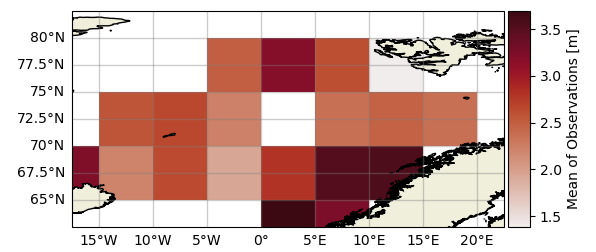

Information of the grid and the values from observations and model can also be obtained directly from the gridder_class object:

.. code-block:: python3

   >>> ovals, mvals, Midx = gco.get_obs_grid_idx()
   
Gridding of collocated data
***************************

It is also possible to grid the collocated data.

.. code-block:: python3

   >>> from wavy.collocation_module import collocation_class as cc

   >>> # collocate
   >>> cco = cc(model='ww3_4km', oco=sco, distlim=6, leadtime='best', date_incr=1)

   >>> # reduce region to part of model domain for better visual
   >>> bb = (-20, 20, 50, 80)  # lonmin,lonmax,latmin,latmax
   >>> res = (5, 5)  # lon/lat
   >>> gco = gc(cco=cco, bb=bb, res=res)
   >>> var_gridded_dict, lon_grid, lat_grid = apply_metric(gco=gco)

   >>> # plot all validation metrics on grid
   >>> gco.quicklook(val_grid=var_gridded_dict, lon_grid=lon_grid, lat_grid=lat_grid, metric='all')
   
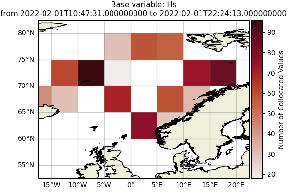
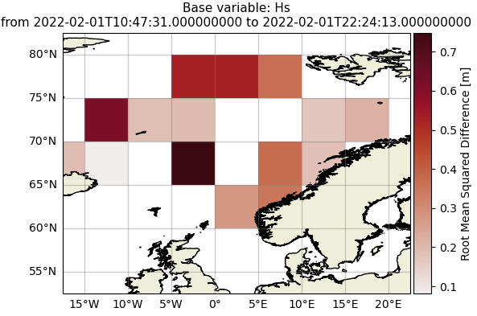

+-------------------+------------------+
| |ex3|             | |ex4|            |
|                   |                  |
+-------------------+------------------+
   
   
9. Applying filters
###################
Finally, it is possible to apply some filters to the data. Let us try it on some 
L2 satellite data already included in the package. 

.. code-block:: python3

   >>> from wavy.satellite_module import satellite_class as sc
   >>> path_to_files= '/home/patrikb/wavy/tests/data/CCIv3_20Hz/'
   >>> sd = '2019-3-24 10'
   >>> ed = '2019-3-24 11'
   >>> region = 'Sulafj'
   >>> sco = sc(sd=sd, ed=ed,
   >>>          nID='L2_20Hz_s3a', name='s3a',
   >>>          region=region)
   >>> sco = sco.populate(path=path_to_files)
   
You can have a first look at the data: 

.. code-block:: python3

   >>> sco.quicklook(a=True, land_mask_resolution='f')
   
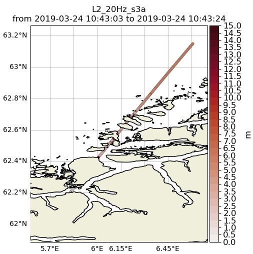

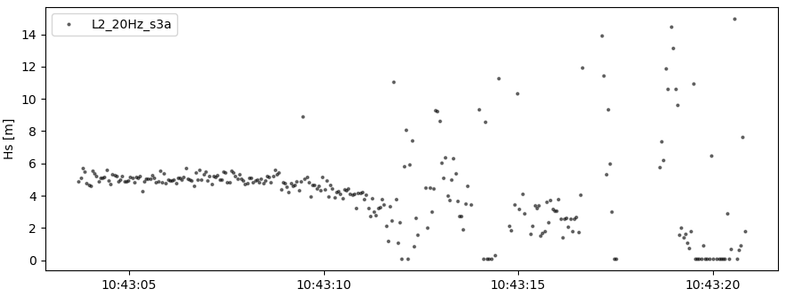

There could be some land interactions with the satellite track. It is possible to filter it using *sco.filter_landMask()* function. Additionnally points closer than a certain distance to the coast can be defined using *sco.filter_distance_to_coast()* with *llim* argument. If specifics (range gate resolution and height over ground) about the satellite intsrument are known one can compute a possible foot print land interaction based on the size of the pulse limited footprint size byt adding *.filter_footprint_land_interaction()*. Finally, values under threshold (resp. over) can also be discarder using the *sco.apply_limits()* method with *llim* argument (resp. *ulim*).

The corresponding code is the following: 

.. code-block:: python3

   >>> sco_filter = sco.filter_landMask()\
   ...                 .filter_distance_to_coast(llim=650)\
   ...                 .filter_footprint_land_interaction()\  
   ...                 .apply_limits(llim=0.1)
   
This can be plotted by:

.. code-block:: python3

   >>> sco.quicklook(a=True, land_mask_resolution='f')
   
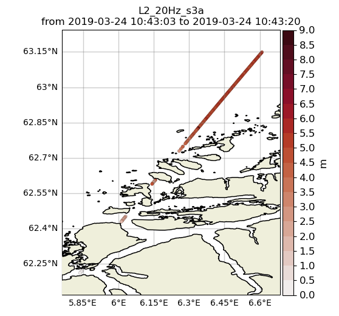

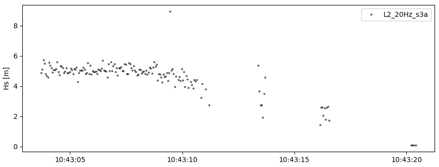

In order to show the computed x-track pulse-limited footprint size one can add:

.. code-block:: python3

   >>> sco_filter.quicklook(a=True, land_mask_resolution='f', plot_xtrack_pulse_limited_fpr=True)
   
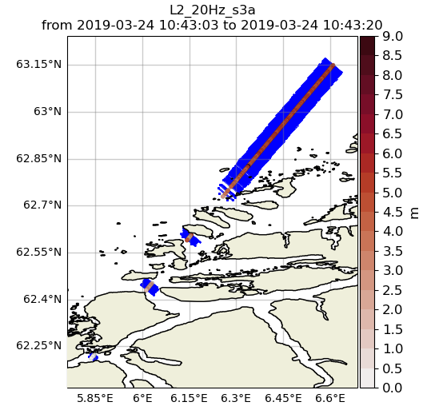

Some additional despiking method can be applied with *sco.despike_blockStd()*.

.. code-block:: python3

   >>> sco_despike = sco_filter.despike_blockStd(slider=20, sigma=2, chunk_min=5, sampling_rate_Hz=20)

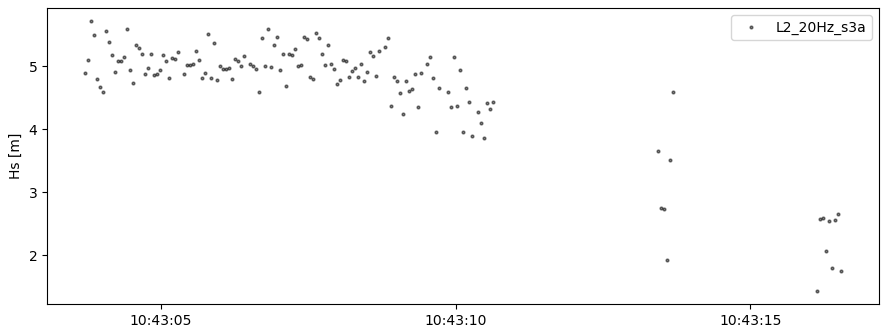

Another operation you can perform is smoothing the time serie, using a running mean with the *sco.filter_runmean* method: 
   
.. code-block:: python3

   >>> sco_smooth = sco_despike.filter_runmean(window=5, chunk_min=5, sampling_rate_Hz=20)

.. image:: ./oslo_ws24_filters_sat_ts_smooth.png
   :scale: 80
   
   
10. Saving data to netcdf
#########################
It is possible to save the data from the different wavy objects to .nc files. If
we take again the first example we used for the satellite data:  

.. code-block:: python3

   >>> from wavy.satellite_module import satellite_class as sc
   >>> # settings
   >>> region = 'global'
   >>> varalias = 'Hs'  # default
   >>> name = 's3a'
   >>> nID = 'cmems_L3_NRT'
   >>> twin = 30  # default
   >>> sd = "2023-2-1 11"  # can also be datetime object
   >>> ed = "2023-2-1 12"  # not necessary if twin is specified
   >>> # retrieval
   >>> sco = sc(sd=sd, ed=ed, region=region, nID=nID, name=name)
   >>> sco = sco.populate()

Then we can save the data contained in *sco.vars* as follows: 
 
.. code-block:: python3

   >>> sco.vars.to_netcdf('/home/patrikb/ws24_wavy/test_dump.nc')
   
This way, you can directly reimport the data by initializing a new satellite_class
object and populate it giving the path to the netcdf file created earlier in 
the *sco.populate()* method using *wavy_path* argument as follows: 

.. code-block:: python3

   >>> from wavy.satellite_module import satellite_class as sc
   >>> # settings
   >>> region = 'global'
   >>> varalias = 'Hs'  # default
   >>> name = 's3a'
   >>> nID = 'cmems_L3_NRT'
   >>> twin = 30  # default
   >>> sd = "2023-2-1 11"  # can also be datetime object
   >>> ed = "2023-2-1 12"  # not necessary if twin is specified
   >>> # retrieval
   >>> sco = sc(sd=sd, ed=ed, region=region, nID=nID, name=name)
   >>> sco = sco.populate(wavy_path='/home/patrikb/ws24_wavy/test_dump.nc')
   
Note that this works with insitu_class and model_class object as well. 
